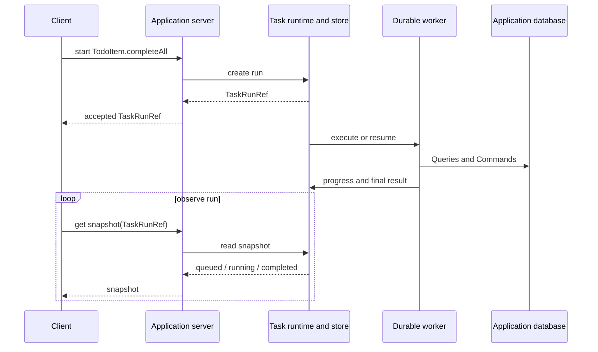

# Durable Operations

A \concept{Durable Operation} is a domain operation whose work continues beyond its initial invocation.
Starting it returns the identity of a run. Progress, completion, and failure are observed through
that run.

## Declare one lifecycle

`completeAll` declares its eventual output and progress alongside the operation:

```ts
const CompleteAllProgress = value('CompleteAllProgress', {
  phase: f.enum(['updating'] as const),
});

const CompleteAllOutput = value('CompleteAllOutput', {
  completed: f.nonNegativeInteger(),
});

completeAll: operation({
  output: CompleteAllOutput,
  durable: {
    runtime: 'in-process',
    progress: CompleteAllProgress,
  },
  run: runCompleteAll,
}),
```

The input schema, contracts, requirements, progress schema, and final output remain one operation
contract. Ontahí projects the task definition that the configured runtime executes.

The operation body receives a task context when the runtime runs it. It can report progress, sleep
without hiding timing semantics, and execute declared steps. In this example `runCompleteAll`
reports the `updating` phase, completes the open Todos, and returns `CompleteAllOutput`.

> [!MARGIN] **One operation, not a command plus a job.** A queue-based application often repeats
> the same use case as an endpoint contract, job payload, status record, and polling DTO. Ontahí
> projects those runtime shapes from the durable operation's lifecycle contract instead of asking
> the application to author a second model.

## Start and follow it from Node

```ts
import { setTimeout as wait } from 'node:timers/promises';
import { TodoItem, TodoApplication } from './graph.js';

const started = await TodoItem.completeAll();
if (!started.ok) throw new Error(started.message);

const run = started.value;
let snapshot = await TodoApplication.getTaskSnapshot(run);

while (snapshot.status === 'queued' || snapshot.status === 'running') {
  await wait(500);
  snapshot = await TodoApplication.getTaskSnapshot(run);
}

console.log(snapshot.status, snapshot.result ?? snapshot.error);
```

`started.value` is a `TaskRunRef`: `taskId`, `runId`, and the status at acceptance. It is not the
final `CompleteAllOutput`.

The snapshot carries the current status, progress, eventual result, or run error. Keeping the Ref
separate lets another process, request, or screen resume observation without restarting the work.

The lifecycle crosses runtimes without changing its identity:



Acceptance, execution, persistence, and observation may happen in different processes. The
`TaskRunRef` is what keeps them one run.

## Observe the same run from React

```tsx
const completeAll = useDurableOperation(TodoItem.domain.completeAll);

return (
  <div>
    <button disabled={completeAll.isExecuting} onClick={() => completeAll.execute()}>
      Complete all
    </button>

    {completeAll.value && <small>Run {completeAll.value.runId}</small>}
    {completeAll.isQueued && <p>Queued…</p>}
    {completeAll.isRunning && <p>{completeAll.progress?.phase ?? 'Running…'}</p>}
    {completeAll.isCompleted && <p>Completed {completeAll.finalValue?.completed ?? 0} Todos.</p>}
    {completeAll.isFailed && <p>{completeAll.runError?.message}</p>}
  </div>
);
```

`value` is the accepted run Ref. `finalValue` is the typed eventual output. The hook keeps start
failure separate from run failure: a failed invocation creates no run; an accepted run may later
reach `failed` or `cancelled`.

Reads invalidated by the operation become stale after successful completion, not merely after the
runtime accepts the start request.

## Snapshots are the observation contract

The Runtime Protocol represents observation as a versioned `durable.operation` request. Starting
the work remains `operation.invoke`; after receiving its `TaskRunRef`, a runtime can inspect that
identity:

```ts
{
  version: 1,
  kind: 'inspect',
  run: { taskId: 'Todo.completeAll', runId: 'run-1' },
}
```

The response is a versioned `snapshot` containing queued, running, completed, failed, or cancelled
state plus progress, result, or error when present. Progress and result are snapshot states, not
commands. Repeating `inspect` is the portable polling primitive.

The React boundary is one Runtime Transport observer. `useDurableOperation` consumes its
asynchronous snapshot sequence; the transport chooses how to produce it from its capabilities. The
Fetch transport polls with repeated `inspect` requests and stops at `completed`, `failed`, or
`cancelled`. A future push-capable transport can produce the same sequence without changing
component code, lifecycle state, or completion-time cache invalidation.

Polling cadence belongs to Fetch configuration, not the hook:

```ts
const client = createFetchGraphClient({
  runtimeTransport: {
    endpoint: '/runtime/ontahi/runtime',
    durableOperation: { pollIntervalMs: 750 },
  },
});
```

The conventional same-origin client uses `POST /runtime`. `OntahiGraphProvider` exposes its Runtime
Transport independently from Operation bridge adapters, so a host can replace observation without
changing invocation. Express requires an explicitly configured common dispatcher and trusted
request-context factory before mounting that path; it does not expose Task state automatically.
The legacy Task snapshot GET remains only as a bounded compatibility surface during endpoint
migration.

## The runtime defines the guarantee

`inProcessTasks()` is the smallest executable runtime. It starts background work and stores task
state locally; it does not promise to survive a process restart.

A persistent executor and task store can carry the same lifecycle across retries, processes, and
deployments. Ontahí's Vercel Workflow adapter is one such runtime. The host owns provider setup,
persistent task storage, credentials, and deployment artifacts; the durable operation remains the
semantic source for its lifecycle schemas.

Use durable steps only where the workflow has a real internal boundary that needs its own typed
input and output. Retry and replay remain explicit runtime or application operations; they are not
hidden side effects of starting a durable operation. `cancelled` can already be observed in a
snapshot, but Ontahí does not yet expose a cancellation request because its Task Runtimes do not
share an enforceable cancellation capability.
