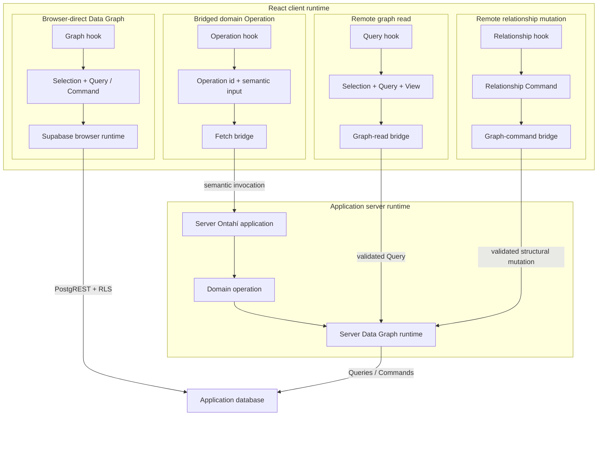

# Transport and HTTP Ingress

A \concept{Transport} carries an operation intention across a process boundary without becoming
a second definition of that operation. Node can invoke `TodoList.rename(...)` directly; a remote
client needs that intention to reach the same application runtime.

Ontahí currently has four relevant execution shapes:

- an **operation bridge** carries generic invocations from an Ontahí client;
- a **graph-read bridge** carries ordinary policy-scoped Queries without inventing an Operation;
- a **relationship-command bridge** carries explicitly permitted structural link mutations;
- **HTTP ingress** gives a particular operation an external route and provider channel.

## The Runtime Protocol foundation

Those execution shapes are converging on one transport-independent Ontahí Runtime Protocol. Core
now defines its first strict envelope and a typed family registry at
`@ontahi/core/runtime/protocol`. This is a semantic boundary between runtimes, not an HTTP request
type:

```ts
import {
  createRuntimeProtocolDispatcher,
  createRuntimeProtocolRegistry,
  runtimeProtocolFamilies,
} from '@ontahi/core/runtime/protocol';

const protocol = createRuntimeProtocolRegistry(runtimeProtocolFamilies);
const parsed = protocol.parseRequest({
  protocol: 'ontahi.runtime',
  version: 1,
  id: 'request-123',
  kind: 'request',
  family: 'graph.command',
  body: {
    version: 2,
    kind: 'graph-command',
    command: serializedCommand,
  },
});
```

The envelope version and family-body version are deliberately independent. The envelope owns only
strict JSON framing, one-exchange correlation, family routing, and common protocol diagnostics.
The complete body remains owned by its family, including its version, policy boundary, typed
result, and semantic rejection. An unknown envelope version, envelope key, family, or family-body
version fails before execution. Authority is supplied by the receiving runtime's trusted context;
it is never accepted from the portable message.

The canonical registry tuple currently contains `operation`, `durable.operation`, `graph.read`,
and `graph.command`. Graph Read and Graph Command delegate to their existing fail-closed parsers
instead of reproducing Query or Command validation. Operation adds body version 1 while preserving
its existing semantic request kinds:

```ts
const invoke = {
  version: 1,
  kind: 'invoke',
  operationId: 'Student.transfer',
  input: { student: studentRef, nextCourse: courseRef },
};

const permission = {
  version: 1,
  kind: 'check-permission',
  operationId: 'Student.transfer',
  input: { student: studentRef, nextCourse: courseRef },
};
```

The Operation family accepts only known keys and portable JSON. An `invoke` may additionally carry
a View for a projectable Selection output; `check-permission` may not. Its parsed body remains
structurally compatible with the existing canonical dispatcher, which continues to own Operation
resolution, input hydration, authority, permission checks, projections, and execution.

Core composes the registered execution boundaries behind one transport-neutral dispatcher:

```ts
const dispatch = createRuntimeProtocolDispatcher({
  handlers: {
    operation: operationDispatcher,
    'durable.operation': durableObservationHandler,
    'graph.read': graphReadDispatcher,
    'graph.command': graphCommandDispatcher,
  },
});

const response = await dispatch(portableRequest, { authority });
```

The receiver-owned context is not serialized. Each handler receives its canonical family body and
that context; an Operation dispatcher can ignore the second argument, while Graph dispatchers use
it for their existing authority policy. A host needing different read and command authority forms
can adapt this opaque context in the corresponding handler without changing the wire contract.

Family response bodies remain intact. An Operation failure, Graph Command rejection, or
family-specific protocol error is wrapped as the correlated response body rather than flattened
into a common success/failure type. A malformed request never reaches a handler. An unknown family,
a registered family unavailable in the receiving runtime, a failed handler, and a non-portable
handler response produce distinct common protocol errors.

A Durable Operation starts through the same `invoke` request. Its successful Operation result
contains a `TaskRunRef`; that run identity is not the outer request id. Observation then uses the
versioned `durable.operation` family:

```ts
const inspect = {
  version: 1,
  kind: 'inspect',
  run: { taskId: 'Todo.completeAll', runId: 'run-1' },
};
```

Its `snapshot` response carries progress, terminal result, or error. Repeated inspection is the
portable polling baseline. The family is registered but has no implicit server handler: a receiver
must install authority-aware observation explicitly. A cancelled snapshot is valid, but no
`cancel` request exists until Task Runtimes expose an enforceable cancellation capability.

React consumes this through a Runtime Transport observer. The Fetch implementation repeats
`inspect` at its configured cadence and yields snapshots until terminal state. The WebSocket
implementation sends one observation control frame and receives the same snapshot bodies by push.
`useDurableOperation` selects neither strategy, and Operation bridge adapters no longer carry Task
snapshot methods.

Express can project an injected common dispatcher at `POST /runtime`. It validates the envelope and
family body before deriving receiver context, but does not install handlers or authorization. The
host explicitly chooses which families the dispatcher exposes. The Fetch client uses that common
path for Operation invocation and permission, Graph Read, Graph Command, and Durable inspection.
The legacy `/operations`, `/graph/reads`, `/graph/commands`, and raw Task GET routes remain bounded
compatibility surfaces.

WebSocket adds a versioned `ontahi.runtime.session` frame around, rather than inside, those Runtime
Protocol messages. `request` frames contain the complete existing request envelope; `response`
frames contain its correlated response. `durable-observe` and `durable-unobserve` use a distinct
observation identity. Pushed `durable-observation` frames retain the versioned Durable family body
and add a monotonic sequence scoped to that observation identity so a client can ignore duplicates
and out-of-order or post-terminal delivery without claiming exactly-once semantics.

```ts
const runtimeTransport = createWebSocketRuntimeTransport({ url: '/runtime' });
const client = createRuntimeGraphClient({ runtimeTransport });
```

One lazy socket multiplexes Operation, Graph Read, Graph Command, and ordinary Durable inspection
requests alongside pushed progress. An aborted observer unsubscribes. Disconnect fails active work
and does not automatically resubscribe it; a later request can create a new session, while replay
and resume remain explicit future guarantees. Fetch polling remains the fallback when a host does
not project WebSocket.

A host application may compose Fetch and WebSocket transports and route each complete envelope by
its `family`. Durable observation is selected separately because it is an asynchronous transport
capability rather than a new family body. This permits Graph reads and Operation invocation over
HTTP while Durable snapshots arrive by WebSocket push, or sends all current families through one
socket. The hook and Entity authoring stay unchanged; routing is chosen before transmission, and a
failure never causes an automatic replay through the other transport.

The WebSocket handshake is an HTTP request, so a same-origin browser automatically includes the
same applicable session cookie used by Fetch. WebSocket does not make CORS an authorization
boundary: credentialed hosts must validate the complete canonical `Origin`, including scheme and
host, during upgrade, restore the server-owned session, derive a narrow invocation context, and
continue enforcing family policy for every message. Production deployments use WSS and a session
store shared by all accepting instances.
Because the current session context is resolved once per connection, immediate logout or
permission revocation also requires closing affected sockets or a host-specific revalidation
strategy.

Next.js App Router can project that same dispatcher without an application-local protocol route:

```ts
import { createNextRuntimeProtocolRouteHandler } from '@ontahi/runtime-nextjs/runtime-protocol';

export const POST = createNextRuntimeProtocolRouteHandler({
  dispatcher: runtimeDispatcher,
  context: async request => ({
    principal: await resolvePrincipal(request),
  }),
});
```

The host chooses the route location, conventionally `app/api/runtime/route.ts`. Like Express, the
adapter validates before deriving context, installs no family handler or policy, and maps common
protocol errors to `400`, `501`, `502`, or `503` while preserving complete family responses at
`200`. The separate Next.js Operation invocation and Graph Read adapters remain compatibility
surfaces for hosts that select them explicitly. Express and Next.js project the same dispatcher
and pass the same four-family Fetch client conformance proof.

## Carry generic operation invocations

The Express adapter mounts the already composed application:

```ts
const ontahiHttp = {
  mountPath: '/runtime/ontahi',
};

type RuntimeAuthority = { principal: ReturnType<typeof authenticate> };

const runtimeDispatcher = createRuntimeProtocolDispatcher<RuntimeAuthority>({
  handlers: {
    operation: (request, authority) =>
      TodoApplication.app.runtime.withInvocationContext(authority, () =>
        operationDispatcher(request),
      ),
    'graph.read': (request, authority) => graphReadDispatcher(request, { authority }),
    'graph.command': (request, authority) => graphCommandDispatcher(request, { authority }),
    'durable.operation': async request =>
      toDurableOperationSnapshotResponse(await TodoApplication.getTaskSnapshot(request.run)),
  },
});

const server = express();

server.use(
  ontahiExpress(TodoApplication, {
    ...ontahiHttp,
    invocationContext: request => ({
      principal: authenticate(request),
    }),
    runtimeProtocol: {
      dispatcher: runtimeDispatcher,
      context: request => ({ principal: authenticate(request) }),
    },
    graphRead: {
      policies: todoGraphReadPolicies,
    },
    graphCommand: {
      policies: [{ entity: TodoItem, relationName: 'tags', actions: ['link', 'unlink'] }],
    },
    explorer: { indexFile },
  }),
);
```

`mountPath` places every Ontahí-owned HTTP surface below one host-selected root:

- `POST /runtime/ontahi/runtime` carries Operation invocation and permission, Graph Read, Graph
  Command, and Durable inspection through the handlers above;
- `POST /runtime/ontahi/operations`, `/graph/reads`, and `/graph/commands` remain legacy routes when
  their adapters are configured and a client selects them;
- `GET /runtime/ontahi/operations/tasks/:taskId/:runId` is the legacy Durable observation path;
- `GET /runtime/ontahi/application` returns reflected application metadata;
- `/runtime/ontahi/explorer/*` serves inspection endpoints when Explorer is enabled.

The React host configures the same mount root once:

```tsx
const client = createFetchGraphClient({
  runtimeTransport: { endpoint: '/runtime/ontahi/runtime' },
  reflectedEntityData: { endpoint: '/runtime/ontahi/explorer/entities' },
});

<OntahiGraphProvider runtime={runtime} client={client}>
  <App />
</OntahiGraphProvider>;
```

With the default root, `OntahiGraphProvider` uses `/runtime` without a `client` prop. There is no
global discovery step: a non-default common path is deployment configuration supplied once to the
client runtime. This also allows one Express application to host several Ontahí applications under
different roots.

For a bounded migration, select only the legacy families the host still serves:

```ts
const client = createFetchGraphClient({
  runtimeTransport: { endpoint: '/runtime/ontahi/runtime' },
  compatibility: {
    operation: { endpoint: '/runtime/ontahi/operations' },
    graphRead: { endpoint: '/runtime/ontahi/graph/reads' },
    graphCommand: { endpoint: '/runtime/ontahi/graph/commands' },
  },
});
```

Compatibility entries win over the deprecated family endpoint aliases. Routing is selected before
transmission; a network or server failure never triggers a second request against another route.

> [!MARGIN] **Express configuration stops at the adapter boundary.** Mount and surface paths,
> Explorer exposure, ingress body limits, and error reporting belong here. CORS, rate limiting, and
> trust-proxy policy remain ordinary host concerns. Authentication providers and sessions also
> belong to the host, which maps their result to Ontahí's invocation Principal; see
> [Authentication and Principals](04-authentication-and-principals.md).

The bridge envelope contains an operation identity and opaque input:

```ts
{
  kind: 'invoke',
  operationId: 'TodoList.rename',
  input: {
    list: {
      kind: 'selection',
      entityName: 'TodoList',
      expression: {
        kind: 'references',
        refs: [{
          kind: 'entity-ref',
          entityName: 'TodoList',
          locator: { id: 'list-inbox' },
        }],
      },
    },
    name: 'Reading queue',
  },
}
```

Application code does not normally construct this envelope. It passes an ID, Ref, record, or
Selection to the generated Entity; input normalization produces the semantic Selection above
before the bridge sends it. The server dispatcher resolves the operation, validates that input,
checks authority, executes it, and returns the same canonical result used by other runtimes.

Express or Next.js therefore supplies one invocation bridge, not one hand-authored endpoint per
operation.

## Three client execution paths

Not every client-side graph action is a domain Operation. Ontahí can interpret permitted Queries
and Commands in a browser runtime backed by Supabase, transport ordinary Queries to a server-only
graph runtime, and carry domain Operations as named intentions:



Browser-direct does not bypass Ontahí. The client still authors Entities, Selections, Queries, and
Commands; the Supabase runtime compiles them and the database enforces its RLS policy. No domain
Operation intention crosses a server boundary.

A remote Query sends a versioned JSON-safe graph program. The server rebuilds it against canonical
Entities and enforces an explicit default-deny policy over fields, operators, ordering, Relation
paths, cardinality, limits, and authority-owned row scope before storage executes it.

A remote Relationship Command sends a smaller versioned program: canonical relation identity,
`link` or `unlink`, and Ref- or Selection-valued endpoints. The server resolves that identity
against its own Entity catalog and enforces a separate default-deny policy over the Relation and
allowed actions. Client table names, join columns, SQL, and executable predicates never cross the
boundary.

The bridge carries something more abstract: “rename this TodoList” or “complete this Selection.”
The server operation may combine graph work, Capabilities, requirements, contracts, or durable
execution before producing its canonical result.

Use browser-direct execution only where the database boundary makes that graph behavior
legitimate. Use a remote Query when storage is server-only but the read is still ordinary data
access. Use a bridged Operation when the intention, invariant, coordination, secret, Capability, or
durable lifecycle belongs in domain behavior.

Relationship Commands are the first remote write primitive. Generic insert, update, upsert, and
delete are not remotely exposed yet; browser writes of those forms against server-only storage
still use Operations until their write-policy algebra is defined. See
[Data Graph Across Boundaries](../05-further-directions/11-data-graph-across-boundaries.md) for the
current boundary and the remaining direction.

## Give an operation explicit HTTP ingress

External systems create different pressure. A webhook already has its own route, authentication,
headers, event vocabulary, delivery identity, and payload shape.

Suppose an application needs to synchronize content after a GitHub push. The operation can remain
available through the generic bridge and also declare a provider-specific entrance:

```ts
syncFromGithubPush: operation({
  exposure: 'bridge',
  input: SyncFromGithubPushInputSchema,
  ingress: [
    ingress.http({
      method: 'POST',
      route: '/webhooks/github',
      provider: 'github-webhook',
      channel: 'source-control.push',
    }),
  ],
  run: syncFromGithubPush,
}),
```

`Content.syncFromGithubPush(...)` and the generic operation bridge still work. The explicit ingress
adds another way to request the same operation under the custom route. If the operation should only
be reachable through the external integration, it can instead use `exposure: 'server-only'`.

With the earlier mount root, the public webhook URL is
`/runtime/ontahi/webhooks/github`. The declared route stays relative to the Ontahí application; the
host decides where the complete runtime lives.

The route is reflected with the operation. Explorer and the host can discover it from the same
application model; no generated endpoint registry is required.

HTTP ingress is broader than webhooks. A provider may be a small JSON decoder for a custom
endpoint. Webhooks are the demanding case because they add external event vocabularies,
signatures, delivery identities, retries, and provider-specific acknowledgements.

## Authenticate and decode before dispatch

The Entity does not receive a raw `Request`. A host provider owns the external protocol:

- read the raw body and provider headers;
- verify the webhook signature;
- parse and validate the provider payload;
- classify the request as accepted, ignored, or rejected;
- emit a normalized `channel`, `deliveryId`, and operation input payload.

The runtime flow is:

```text
HTTP request
  -> provider verification and decoding
  -> { providerKey, channel, deliveryId, payload }
  -> reflected ingress route match
  -> canonical operation dispatcher
  -> operation
```

The application composes that boundary once:

```ts
server.use(
  ontahiExpress(Application, {
    mountPath: '/runtime/ontahi',
    ingress: {
      providers: {
        'github-webhook': createGitHubWebhookIngressProvider({
          getSecret: requireGitHubWebhookSecret,
        }),
      },
    },
  }),
);
```

`ontahiExpress(...)` reads the reflected routes and supplies the same transport-neutral dispatcher
used by the first-party bridge. The provider registry is the only application-specific transport
wiring: it verifies and normalizes each external protocol.

The provider contract itself does not depend on Express. A Next.js, Koa, or future HTTP adapter can
reuse the registry and the canonical ingress router while owning its framework-specific raw request
and response conversion.

## One webhook route, different operations

A provider endpoint does not have to equal one operation. An application integrated with GitHub can
use the same webhook route for several typed channels:

- `source-control.push` enters a content-sync operation;
- `source-control.installation.deleted` enters an integration-removal operation.

The provider understands GitHub's event vocabulary and emits the channel. Reflected ingress
metadata selects the operation that owns that meaning. Neither operation contains signature code
or a switch over every GitHub event.

> [!MARGIN] **An event is not an operation invocation.** A webhook reports that something happened;
> an operation invocation requests application work. The provider and ingress mapping cross that
> boundary deliberately. This leaves room for one event to be ignored, invoke one operation, or
> eventually fan out without pretending the two concepts are identical.

> [!MARGIN] **Channels point toward a wider event model.** Today an ingress channel lets an
> operation subscribe to one normalized external event. The same vocabulary could eventually join
> events produced by Entities and graph changes with events received from third-party systems. That
> would let workflows compose both worlds without making an event and an operation invocation the
> same thing. This unification is a direction, not yet a settled event API.

## Keep delivery semantics explicit

A valid signature proves the source of a delivery. It does not establish domain authorization,
make repeated deliveries harmless, or make external acknowledgement atomic with application work.

Transport delivery deduplication and operation idempotency are related but different guarantees.
A durable operation can return a run reference quickly and continue elsewhere; the host still owns
webhook acknowledgement policy, retries, raw-body handling, secrets, correlation, and observability.

> [!MARGIN] **Current low-level surface.** `ingress.http(...)` and its reflected route are the stable
> direction. HTTP adapters can now mount reflected routes from a provider registry, while delivery
> context, event fan-out, and resource binding remain APIs in motion. They should not force Express,
> Next.js, or another host technology into the enduring domain meaning of an operation.

The same dispatcher boundary can be carried by Fetch, Express, Next.js, a webhook, or a future
queue or CLI adapter. Transport changes how an invocation travels; it does not redefine what the
operation means.
