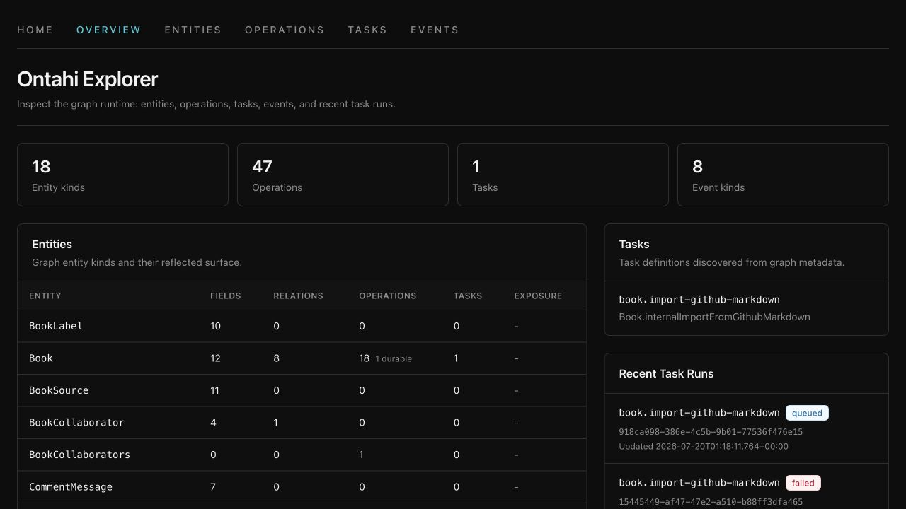
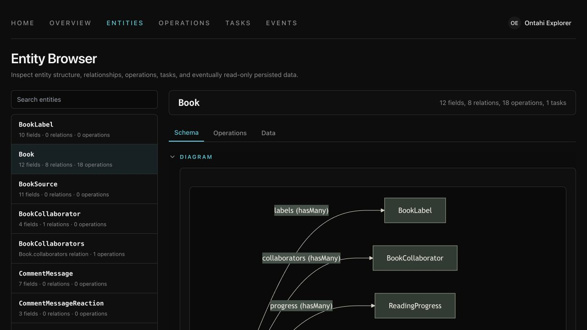
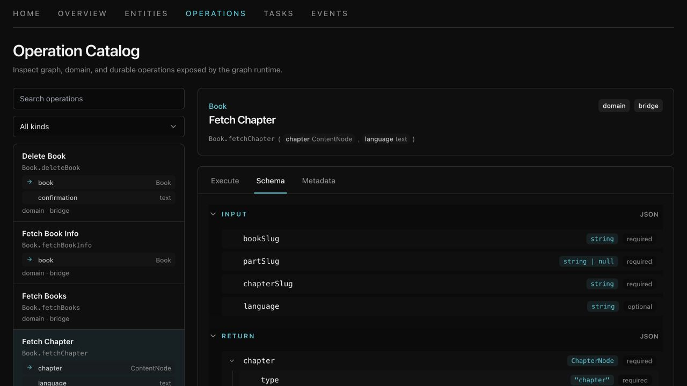

# Reflection and Explorer

\concept{Reflection} makes the composed application inspectable. It does not reverse-engineer HTTP routes,
database tables, or TypeScript source. The same graph that executes the application exposes a
catalog of its Entities, operations, tasks, and ingress.

Explorer is one consumer of that catalog. It turns reflected meaning into a UI; it is not a second
place to declare the application.

## Inspect the application from Node

The smallest reflection surface is already on the composed application:

```ts
import { TodoApplication } from './graph.js';

const description = TodoApplication.graph.describe();

for (const operation of description.domainOperations) {
  console.log(`${operation.id} [${operation.authority}/${operation.exposure}]`);
}
```

`describe()` returns a serializable summary suitable for inspection or transport. Adapters that
need the richer runtime declarations use the same Graph API:

```ts
const graph = TodoApplication.graph;

graph.listEntities();
graph.listGraphOperations();
graph.listDomainOperations();
graph.listTaskDefinitions();
graph.listHttpIngress();
```

These catalogs contain the resolved declarations, including operation schemas and Entity
definitions. Reading them does not query application data or execute an operation.

> [!MARGIN] **The model becomes conscious.** Explorer does not guess that a field is an Entity
> identity, that an input is a Selection, or that work is durable. Those links are visible because
> the application expressed them semantically instead of leaving them implicit in handlers,
> payloads, and tables.

## Project reflection into Explorer

Explorer's server projection combines the catalogs into neutral descriptors:

- Entities include fields, semantic Relation topology, display metadata, exposure, and operation
  counts;
- operations include identity, kind, authority, exposure, input and output schemas, Ref inputs,
  named portable conditions and dependencies, bridge metadata, durable lifecycle, and HTTP ingress;
- tasks include their input, progress, result, and step contracts.

Those descriptors are plain data. `@ontahi/explorer-react` consumes them to render the overview,
Entity browser, operation browser, task browser, schemas, topology, and execution forms.



This is distinct from the browser codegen projection. Codegen emits typed executable Entities for
application code. Runtime reflection emits data descriptors for tools that discover the
application dynamically.



## Mount the reflective surface

The Express adapter can expose reflection and mount an Explorer application alongside the
operation bridge:

```ts
server.use(
  ontahiExpress(TodoApplication, {
    mountPath: '/runtime/ontahi',
    explorer: { indexFile: explorerIndexFile },
  }),
);
```

This configuration supplies four different surfaces:

- `GET /runtime/ontahi/application` returns the compact Graph API description;
- `GET /runtime/ontahi/explorer/snapshot` returns Explorer descriptors;
- `POST /runtime/ontahi/explorer/entities` reads paged Entity data when a reflected data reader is
  available;
- `/runtime/ontahi/explorer/*` serves the host's Explorer UI.

The UI remains optional. A service can expose only `/application`, disable it with
`applicationPath: false`, mount Explorer only in selected environments, or protect both behind
host middleware.

## Supply runtime powers explicitly

Explorer components can render descriptors without being allowed to read data or execute
Operations. The conventional client provides those Fetch capabilities lazily; a non-default mount
root configures them once:

```tsx
const mountPath = '/runtime/ontahi';

const client = createFetchGraphClient({
  graphRead: {
    endpoint: `${mountPath}/graph/reads`,
    commandEndpoint: `${mountPath}/graph/commands`,
  },
  operations: { mountPath },
  reflectedEntityData: { endpoint: `${mountPath}/explorer/entities` },
});

<OntahiGraphProvider runtime={browserRuntime} client={client}>
  <ExplorerShell basePath={`${mountPath}/explorer`} currentPath={pathname}>
    <ExplorerOverview snapshot={snapshot} />
  </ExplorerShell>
</OntahiGraphProvider>;
```

At the conventional root, the provider needs neither `client` nor individual reader and invoker
props. A fully explicit host can replace one capability or set `client={false}` and supply all of
them itself.

The package owns Explorer routes below `basePath`, its default shell, theme handling, operation
input projection, and generic Entity, operation, and task views. The host chooses the outer route,
loads the snapshot, and selects which reflected runtime capabilities to register.

Invoking from Explorer is not a special execution path. The reflected invoker sends
`operationId + input` through the same canonical dispatcher as the generated client. Input is
validated and only bridge-exposed domain operations are available through the Fetch invoker.



Entity browsing is also explicit. In-memory and PostgreSQL storage bindings can supply reflected
data reading with the application storage; Supabase has its own reader adapter. The host still
chooses the concrete client, credentials, and database policy used for that inspection.

Reference Fields are presented as semantic Ref links, not as raw storage ids. Explorer prefers
received display identity and otherwise labels the link from its portable locator; following it
navigates to the related Entity instance without claiming that the Ref already contains current
attributes.

The Entity detail reflects each Relation's declared endpoint, target Entity, direct kind,
forward/inverse direction, cardinality, nullability, and cardinality-specific structural verbs.
Those verbs are static read-only metadata, not an authority decision or an Execute control. When
only one endpoint was declared, schema reflection may add a `derived-inverse` descriptor with no
verbs so the graph is visible without inventing an application member.

Derived Fields remain visible as ordinary Entity Fields and are labeled `derived · read-only` with
their exact stored-Field and Relation-aggregate dependencies. Entity data readers return their
authorized runtime value rather than looking for a physical column. Explorer does not evaluate the
expression itself and never treats the rows currently displayed in a panel as complete aggregate
evidence.

For declared `hasMany` and `manyToMany` Relations, the data browser can open a related-instances
panel. Loading that panel uses the host-provided related-data reader, which must execute a
Relation-root Query through the configured runtime and graph-read policy. Explorer neither reads a
provider table directly nor reimplements authorization. A Ref already present can be displayed as
identity; loading target attributes is always an authorized graph read.

Association-shaped records remain ordinary Entities. Explorer reflects explicit graph-relation
ownership when present and otherwise reports classification `unknown`; it never guesses from the
presence of required Ref fields.

> [!MARGIN] **Explorer is not authorization.** Removing an Execute tab or hiding the route is not a
> security boundary. The host must protect the HTTP surface, operation invoker, Entity data reader,
> task-run loaders, and any elevated credentials with its real access policy.

## Keep the host boundary visible

| Concern             | Ontahí supplies                                              | The host supplies                                                                 |
| ------------------- | ------------------------------------------------------------ | --------------------------------------------------------------------------------- |
| Model catalog       | Entity, operation, task, ingress, and schema reflection      | The application composition to inspect                                            |
| HTTP surface        | Generic invocation, snapshot, and Entity-data handlers       | Mount path, middleware, error reporting, and exposure policy                      |
| Explorer UI         | Descriptor contracts, routes, shell, browsers, and forms     | App routing, static bundle, theme choice, and optional UI extensions              |
| Operation execution | Reflected invoker contract and canonical dispatcher          | Transport, identity, authentication, and authorization policy                     |
| Entity data         | Reader contracts plus semantic Ref and Relation presentation | Credentials, RLS/service role choice, graph-read policy, and permitted data scope |
| Durable runs        | Task descriptors and run/source UI contracts                 | Persistent runtime, run loaders, retention, and access control                    |

The host completes the application at its environmental edges. It should not duplicate Entity
schemas, operation contracts, or topology merely to make them inspectable.

## Treat Explorer descriptors as a tool boundary

The current public direction is stable: application reflection produces neutral descriptors, and
Explorer consumes them through host-supplied runtime capabilities. Some assembly remains
deliberately low-level—snapshot loading, task-run sources, custom Ref inputs, and app-specific event
metadata.

The current Relation slice is deliberately read-only: Explorer has no `assign`, `clear`, `add`, or
`remove` controls. Do not build domain behavior against `ExplorerSnapshot`. Domain code belongs in Entities,
Selections, operations, and Capabilities. Explorer descriptors are a projection for inspection and
tooling, free to evolve as the reflective model becomes richer.

The Ontahí form now closes where it began: one application declaration. Runtimes execute it,
codegen carries a safe projection to authored clients, reflection carries a descriptive projection
to tools, and the host binds both to the outside world.
