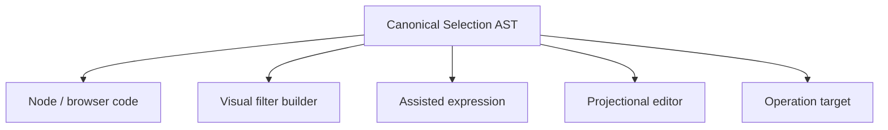

# Selection as an Editable Language

The Selection AST already carries the same membership criterion through Node, React, operations,
and transports. Code is only one projection of that language.

## Shipped read authoring

The [Semantic Console](../04-reflection-and-clients/03-semantic-console-and-devtools.md) is now a
working client surface, covered in Part IV. The direction here is to extend those projections,
not to treat the existing read editor as an unimplemented idea.

The Semantic Console already offers TS-like and declarative projections over one canonical read
model. For example, `TodoItem.where(completed = false).many()` and
`TodoItem where completed = false many` describe the same read. These are bounded Ontahí dialects,
not arbitrary JavaScript or SQL execution.

Both projections support read terminals, named factories, contextual navigation and classified
roots when reflected and authorized by the receiver. Rich Boolean/enum editors and ordering-field
pickers share semantic assistance. Autocomplete and sortable headers use discovered capabilities
before reading rows; server validation still applies independently. Editing sort or limit in the
result table rewrites the authored expression and executes it through the normal transport.

Settings persists the authoring-language preference. Console, Explorer/search predicates and
Activity read descriptions respect that preference; changing dialect does not execute a draft.
Invalid drafts stay in their current dialect until they can be converted safely.

The Console executes reads only. Commands, Operation invocation, arbitrary reference pickers and
data-dependent completion remain further work rather than implicit promises of the read syntax.

## Further projections

A Selection language service can project the AST as a filter builder, assisted expression,
structural editor, or hybrid surface. Entity reflection can drive typed fields, operators,
completion, diagnostics, and Ref pickers. The result remains the canonical Selection AST, ready to
preview, save, share, or pass directly to an operation.

That makes a UI filter more than local component state. A user could visually author “Todos older
than 30 days,” inspect the resulting Selection, and invoke the same `TodoItem.complete(...)` operation
used by Node code. Text, chips, form controls, and raw AST become synchronized projections rather
than competing query languages.
