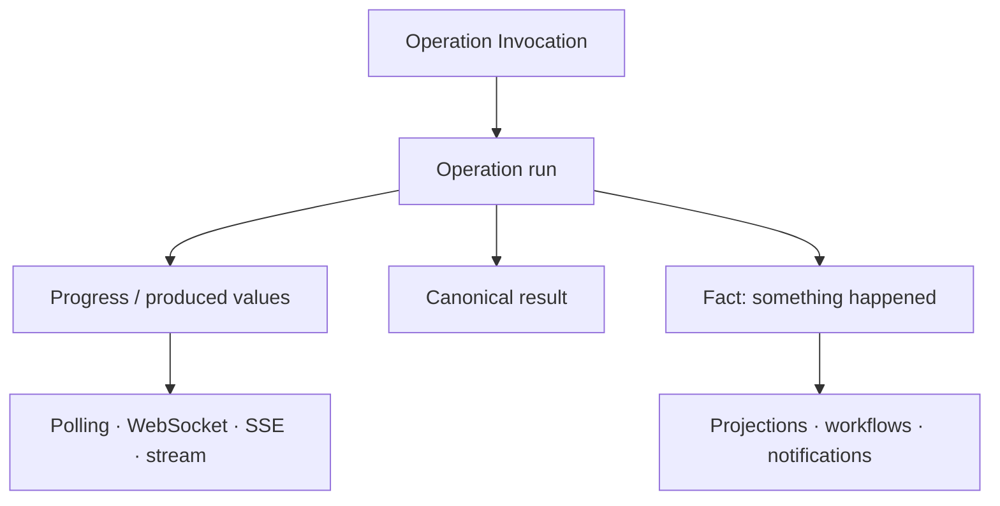

# Continuous Execution and First-Class Events

Durable work already has two observation paths: Fetch polls, while WebSocket pushes snapshots of
the same `TaskRunRef`. WebSocket also carries supported Graph Query observations. These are current
contracts, described in [Runtime Transport](../03-runtimes/03-transport-and-http-ingress.md), not
future Event APIs.

The remaining direction is broader: SSE or gRPC adapters, resumable delivery, and Operations that
naturally produce many values need explicit contracts for identity, ordering, backpressure,
completion, failure and reconnection. None follows merely from having a socket.

Events are the other half. An operation invocation requests work and expects a result. An event
states that something happened and may fan out, persist, replay, or feed projections. Ontahí's
current effect events and typed HTTP ingress channels are evidence for one reflected event model
covering both application facts and third-party facts.

This is a deliberate design gate for the Ontahí Runtime Protocol. Events must not be added as just
another transport message because BookOps happens to emit or consume something event-shaped.
Before remote subscription or delivery is specified, Ontahí still needs a first-class answer for
Event declaration, portable identity, emission, authority, lifecycle, ordering, durability,
acknowledgement, replay, and failure. BookOps is implementation evidence for that work, not the
framework contract.

With that model, notifications, cache invalidation, projections, workflows, and realtime UI can
subscribe to declared events without making domain code choose a queue or socket technology.
