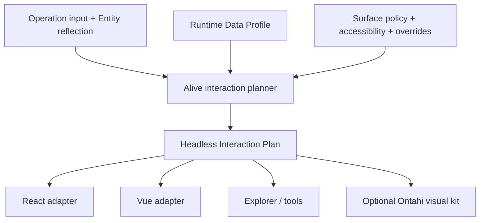

# 117. Alive UI From Reflected Selections

Status: backlog

Canonical ID: `ontahi://plans/117-alive-ui-from-reflected-selections`

Migrated from: `bookops://plans/117-alive-ui-from-reflected-selections`
Original path: `plans/backlog/117-alive-ui-from-reflected-selections.md`
Source commit: `cb9c038a`

Shapes: [`Alive UI`](ontahi://atlas/application-architecture-surface/alive-ui)

Related plans:

1. [`76. Operation Input Metadata And UI`](bookops://plans/76-operation-input-metadata-and-ui)
2. [`91. Reflective Architecture Admin UI`](bookops://plans/91-reflective-architecture-admin-ui)
3. [`116. Ontahi Selection Model`](../done/116-ontahi-selection-model.md)
4. [`118. Ontahi Selection Language Editor Research`](../research/118-ontahi-selection-language-editor.md)
5. [`126. Ontahi Runtime Data Reflection`](../research/126-ontahi-runtime-data-reflection.md)

## Summary

Shape Alive UI as a headless interaction framework over Ontahi Entities, Selections, and operations.
It should combine semantic reflection, Runtime Data Reflection, and surface policy to choose viable
interaction patterns without turning component names into domain metadata.

Visual components are an optional projection. The durable core owns interaction planning, state,
behavior, validation, preview, and invocation so React, Vue, Explorer, terminals, or another host
can render the same decision honestly.

## Context

A selection input already exposes its Entity and required cardinality. That is enough to know that
`Book.transfer(...)` needs one `User`; it is not enough to choose the interaction.

If twelve eligible users can be enumerated cheaply, a radio list or compact picker may work. If
two million users are visible through indexed search, the same semantic input needs typeahead and
pagination. If search is unavailable, the UI must expose that limitation rather than downloading
or pretending to enumerate the population.

The previous sketch bundled this runtime knowledge into Alive UI. Plan 126 now names Runtime Data
Reflection as a separate foundation that can also power Explorer, analytics, charts, and tools.

## Research / Evidence

Current Ontahi pieces already prove parts of the loop:

1. operation inputs reflect Entity Refs, Selections, cardinality, fields, and validation;
2. `useOperation(operation, initialInput)` provides a first headless input state and execution
   binding;
3. Explorer renders reflected Ref and Selection pickers;
4. `ReflectedEntityDataReader` supplies searchable, filterable, paginated rows and counts;
5. the Selection AST can represent explicit members or open comprehension without changing the
   operation that consumes it.

What is missing is one framework-neutral interaction planner and a component protocol that keeps
domain facts, runtime facts, and presentation policy distinct.

## Scope

1. Define the inputs to Alive UI: semantic contract, Runtime Data Profile, authority, surface
   context, accessibility requirements, latency policy, and application overrides.
2. Define a headless `InteractionPlan` rather than returning a component name.
3. Define patterns for single Ref, many Refs, Selection, scalar/structured operation inputs,
   result preview, and execution.
4. Define stable behavior when runtime profiles change while the user is interacting.
5. Define honest fallbacks for unknown, unsupported, partial, stale, or approximate capabilities.
6. Define adapter boundaries for React and other hosts.
7. Evaluate an optional Ontahi visual kit without making it the ownership boundary.
8. Keep the Selection language editor reusable rather than rebuilding its AST inside Alive UI.

## Non-Goals

1. Do not implement Alive UI while Runtime Data Reflection and Selection editor boundaries remain
   research-shaped.
2. Do not couple the headless engine to React or one component library.
3. Do not add widget hints to Entity, Selection, or operation contracts.
4. Do not infer semantic input cardinality from database statistics.
5. Do not require every application to use the suggested visual pattern.
6. Do not make Explorer Data a hidden prototype of the full architecture.
7. Do not hide unsupported storage or authority behavior behind a loading spinner.

## Proposed Form



Illustrative output, not a frozen API:

```ts
type InteractionPlan =
  | { kind: 'enumerate'; presentation: 'radio' | 'compact-list'; source: Selection }
  | { kind: 'search'; mode: 'typeahead'; minPrefix: number; pageSize: number }
  | { kind: 'compose-selection'; editor: SelectionEditorProtocol }
  | { kind: 'unsupported'; reason: string; alternatives: InteractionAlternative[] };
```

The plan describes viable behavior and evidence. A host renderer may choose a different visual
component while preserving enumeration, search, validation, and invocation semantics.

## Candidate Outcomes

1. single-selection inputs rendered as an appropriate radio list, picker, or typeahead;
2. multi-selection inputs rendered as explicit members, filters, or a projectional Selection
   editor;
3. adaptive enumeration based on authority-scoped population and provider capabilities;
4. honest approximate counts and partial-result signals;
5. operation forms whose draft, validation, preview, and invocation share one contract;
6. tables, statistics, widgets, and dashboards reusing the same Selection and runtime profiles;
7. optional accessible visual defaults without requiring one design system.

## Execution Slices

### Slice 1: Interaction Vocabulary

- [ ] Inventory current reflected inputs, headless operation state, Explorer pickers, and Selection
      editor proposals.
- [ ] Define the minimal interaction plan vocabulary and application override rules.
- [ ] Separate durable headless state from ephemeral renderer state.

### Slice 2: Decision Matrix

- [ ] Sketch one Ref over small, large, unknown, searchable, and non-searchable populations.
- [ ] Sketch explicit-membership and comprehension Selections.
- [ ] Sketch transitions when profile freshness or capabilities change.
- [ ] Define accessible keyboard, loading, empty, partial, denied, and failure states.

### Slice 3: Headless Prototype

- [ ] Consume a Runtime Data Profile rather than a storage adapter.
- [ ] Produce one interaction plan for small enumeration and one for large search.
- [ ] Bind draft, validation, preview, and execution without duplicating the operation input.
- [ ] Project the same plan through two intentionally different renderers.

### Slice 4: Recommendation

- [ ] Decide package boundaries for the planner, host adapters, and optional visuals.
- [ ] Define conformance and accessibility checks.
- [ ] Extract implementation only after Runtime Data Reflection resolves its profile boundary.

## Verification

- [ ] The same operation input chooses a list for a small population and search for a large one
      without changing the operation contract.
- [ ] The planner imports neither PostgreSQL, Supabase, nor a concrete component library.
- [ ] Unknown and approximate runtime knowledge remain visible in the interaction plan.
- [ ] An application can override presentation without reimplementing semantic input behavior.
- [ ] React is an adapter, not the architectural boundary.
- [ ] The Selection AST remains canonical across visual, textual, and operation-input projections.
- [ ] Authority and accessibility are part of the decision, not post-render patches.

## Decisions

1. Runtime Data Reflection precedes Alive UI and remains useful without it.
2. Alive UI is headless first; visual components are optional projections.
3. Semantic contracts, runtime knowledge, and presentation policy remain separate inputs.
4. The engine returns an interaction plan, not a hardcoded widget name.
5. Exact counts, estimates, and previews evaluate a Selection; they do not become Selection
   membership operators.
6. Application overrides remain first-class because viable interaction is not the whole product
   design.

## Open Questions

1. How stable should an interaction remain when the underlying profile changes mid-session?
2. Does the planner return one recommendation, ranked alternatives, or constraints only?
3. Which accessibility requirements belong in the core planner versus host policy?
4. How should latency and cost budgets enter a browser-safe interaction plan?
5. Can optional visuals remain useful without quietly becoming the de facto semantic API?
6. Where is the boundary between Alive UI and the Selection language editor?

## Closure / Evolution

Revisit implementation after Runtime Data Reflection produces an authority-safe profile and the
Selection language editor establishes its reusable protocol. Until then, use this plan to preserve
the headless architecture and prevent component-specific metadata from leaking into the model.
