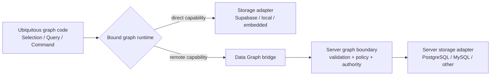

# 128. Ontahi Data Graph Execution Bridge

Status: current

Canonical ID: `ontahi://plans/128-data-graph-execution-bridge`

Migrated from: `bookops://plans/128-data-graph-execution-bridge`
Original path: `plans/next/128-ontahi-data-graph-execution-bridge.md`
Source commit: `67713696`

## Summary

Let the same Ontahi Selection, Query, or Command execute through the runtime available at the call
site. A browser runtime with safe storage access may lower the graph program directly. A browser
whose storage is server-only may transport that graph program to a server runtime and receive the
same result without requiring a wrapper Domain Operation.

A Domain Operation remains the language for named domain behavior, invariants, side effects,
contracts, durable execution, and intent. It should not be a mandatory transport envelope around
ordinary graph reads and writes.

## Context

The operation-first bridge proved that Ontahi can transport a semantic invocation independently
from HTTP, Next.js, or Express. It also exposed a category mistake in the current client ergonomics:
a developer must sometimes declare an Operation only because the browser cannot reach PostgreSQL.

```ts
const visibleTodos = TodoItem.selection(todo => todo.completed.eq(false));

await visibleTodos.orderBy(todo => todo.title).run();
await visibleTodos.update({ completed: true }).run();
```

Those statements already describe complete data-graph programs. Whether they lower to Supabase in
the browser or cross a server boundary before lowering to PostgreSQL is an execution-topology
decision, not additional domain meaning.

Related work:

1. [55. Runtime-Agnostic Data Graph And Pluggable Adapters](bookops://plans/55-runtime-agnostic-data-graph-and-pluggable-adapters)
2. [57. Client Runtime Bridge And Server Dispatch](bookops://plans/57-client-runtime-bridge-and-server-dispatch)
3. [68j. Graph Execution Authority API](bookops://plans/68j-graph-execution-authority-api)
4. [116. Ontahi Selection Model](../done/116-ontahi-selection-model.md)
5. [118. Ontahi Selection Language Editor](bookops://plans/118-ontahi-selection-language-editor)
6. [128a. Recursive Views And Projectable Operation Results](../done/128a-ontahi-recursive-views-and-projectable-operation-results.md)
7. [128b. Projectable Operation Client Bridge](../done/128b-ontahi-projectable-operation-client-bridge.md)
8. [134. Semantic Codegen Pipeline, Organization, And Coverage](./134-codegen-analysis-organization-and-semantic-coverage.md)

## Architectural Thesis



The runtime binding owns execution. The portable graph program does not know whether execution is
local, direct-to-storage, remote, cached, observed, or eventually split across graph segments.

Operation invocation and graph execution are parallel protocols:

1. **Operation invocation** transports named domain intent and its typed input.
2. **Graph execution** transports a canonical Query or Command program.

An Operation may execute graph programs internally. A graph program does not become an Operation
merely because it crosses a process boundary.

## Scope

1. Define canonical transport-safe Query and Command request forms.
2. Bind `Selection.run()`, shaped reads, and Commands to either direct or remote runtimes.
3. Define a server graph dispatcher independently from HTTP framework adapters.
4. Model graph access policy independently from transport choice.
5. Preserve authority, validation, cardinality, result, failure, cache, and observability semantics
   across both execution paths.
6. Prove API parity with one direct-storage browser topology and one server-storage topology.

## Non-Goals

1. Do not make every Entity, field, operator, or Command remotely accessible by default.
2. Do not treat client-side validation as a security boundary.
3. Do not replace Domain Operations that encode domain behavior or invariants.
4. Do not make the wire representation provider-specific.
5. Do not hide unsupported provider capabilities behind silent fallback behavior.

## Canonical Programs

A remote read needs the same semantics already present in a built graph read:

1. root Entity identity,
2. Selection AST,
3. projection and includes,
4. ordering and limit/pagination,
5. cardinality and read mode (`get`, `run`, or `count`); stream-like observation remains a later
   versioned transport capability,
6. authority and request context supplied by the runtime rather than authored into the AST.

A remote Command additionally needs:

1. command kind (`insert`, `upsert`, `update`, or `delete`),
2. payload,
3. returning shape,
4. cardinality and conflict semantics.

The server must rebuild and validate the canonical program against its registered graph. It must
not accept executable JavaScript, adapter queries, table names, or arbitrary SQL.

## Policy Is Not Transport

The concern that “a client could execute any query or update” is valid, but wrapper Operations are
only an accidental allowlist. They duplicate graph code and couple authorization to distribution.

Declaring or registering an Entity never grants remote access to it. Registration only lets the
authoritative runtime resolve its semantic identity; a separate, explicit remote graph policy must
opt that Entity and its permitted surface into remote execution. Missing policy is a denial, not an
implicit full-access default.

The graph boundary needs explicit policy over semantic programs. Candidate dimensions include:

1. which Entities are readable or writable;
2. which fields may be selected, filtered, ordered, inserted, or changed;
3. which operators and relation traversals are allowed;
4. maximum page size, affected-row count, and command cardinality;
5. an authority-derived Selection that is intersected with every requested target;
6. predicates or invariants that require escalation to a Domain Operation;
7. separate defaults for reads and Commands, with remote Commands defaulting to deny.

The policy model should be reflectable enough for clients and Explorer to anticipate available
behavior, while enforcement remains at the authoritative execution boundary.

An owner or tenant constraint is an authority scope, not a coarse `public`/`private` Entity flag.
The server derives that scope from trusted invocation authority and intersects it with the caller's
Selection before execution. The caller cannot provide or weaken the authority scope. Row scope is
necessary but insufficient by itself: policy must also constrain selected fields, filter and order
fields, operators, relation traversal, cardinality, and limits. A remotely readable `User` Entity,
for example, may still deny credentials entirely and constrain visible rows to the current owner or
organization.

Direct browser storage does not weaken this rule. Supabase can safely execute from the browser only
because PostgreSQL RLS and grants enforce authority at the data boundary. Ontahi policy may describe
and preview that boundary, but client checks cannot replace it. A remote PostgreSQL adapter enforces
the corresponding policy in the server graph dispatcher.

## Runtime Routing

The call-site language stays stable:

```ts
const staleTodos = TodoItem.selection(todo => todo.updatedAt.lt(thirtyDaysAgo));

const rows = await staleTodos.orderBy(todo => todo.title).run();
await staleTodos.update({ archived: true }).run();
```

The configured runtime chooses among capabilities:

1. lower directly through a local/browser storage adapter;
2. serialize and invoke a remote graph executor;
3. reject execution because no compatible or authorized capability exists;
4. later route different Entity segments through different executors.

Routing must remain observable. Reflection and diagnostics should show where a graph program will
execute, under which authority, with which policy and provider capabilities.

## Cache And Observation

Canonical Query programs can provide stable cache identity without operation-specific
`bridge.query` functions. Commands can expose affected Entity and Selection information for cache
reconciliation without operation-specific invalidation boilerplate.

Streaming or observing a read is a later transport capability over the same Query identity. Polling,
WebSockets, server-sent events, and provider-native subscriptions should not create different query
languages.

## Execution Slices

- [x] Bind semantic Selections to an available runtime while preserving the portable Selection AST.
- [x] Define recursive caller-authored Views and projectable Selection-shaped Operation results in
      Core before freezing the remote read protocol. Completed in plan 128a.
- [x] Carry projectable Operation Views through generated clients, React, and the existing
      Operation bridge. Completed in plan 128b.
- [x] Specify a versioned Query wire protocol with validation limits.
- [ ] Define a transport-neutral remote graph executor and server dispatcher.
- [ ] Shape a first-class, default-deny read policy declaration and enforcement seam.
- [ ] Add an HTTP adapter without embedding HTTP concepts in the graph protocol.
- [ ] Bind generated client Entities to either direct or remote graph executors.
- [ ] Prove identical Todo read code against direct and Express/PostgreSQL topologies.
- [ ] Integrate read cache identity, telemetry, and Explorer reflection.
- [ ] Specify the Command protocol only after the read path and its authority seam are proven.
- [ ] Evaluate hybrid routing as an input to future graph segmentation.

### First Proof: Runtime-Bound Selections

PR #483 implements the first slice. A Selection remains a portable membership value through
`toJSON()`, but when authored from a runtime-bound Entity it retains that execution binding.
Projection methods promote the same value to a bound read; `update`, `updateReturning`, `delete`,
and `deleteReturning` produce bound Commands. Operation Selection inputs are rehydrated with the
server Entity's runtime, so implementations use their semantic input directly.

This proof closes the ubiquitous _in-process_ language gap. It does not yet define the remote wire
protocol or its default-deny graph policy; the next slice now owns that bounded remote-read proof.

### Completed Prerequisite Slice: Recursive Views And Projectable Results

Plan 128a now owns the active transport-free proof. It defines a recursive View AST and composes a
caller-authored View with an Operation-produced Entity Selection into one final local Query plan.
This prevents the remote protocol from freezing the current `include`/`select` authoring friction or
a fixed Operation snapshot model into the wire format.

The proof uses Trip, Truck, Driver, Owner, Company, Stop, Place, and Country definitions in focused
Core tests. It does not add React, HTTP, authorization, remote Commands, or a BookOps migration.

### Completed TDD Slice: Read Program Wire Round-Trip

Start with a transport-free Core proof that one resolved Query becomes a versioned JSON-safe read
request and can be rebuilt against server-owned Entity definitions without executable JavaScript or
provider metadata.

The first request carries root Entity identity, recursive Selection, caller-authored View,
ordering, limit, cardinality, and read mode. Tests must round-trip the request through JSON and
compare the rebuilt semantic Query plan with the local one. Initial rejection coverage includes an
unsupported protocol version, unknown Entity, unknown field or operator, incompatible View, and
non-JSON-safe predicate values.

This slice does not add a remote runtime, dispatcher, policy declaration, HTTP adapter, generated
client binding, or Commands. It may preserve the applied View AST on the in-memory Query spec so the
wire encoder does not reverse-engineer caller intent from compiled `select`/`include` builders.
Plan 134 may continue reorganizing codegen independently; codegen integration waits for its
semantic emitter cutover.

### Current TDD Slice: Default-Deny Remote Read Boundary

The next proof is a transport-neutral dispatcher whose remote Entity registry is explicit and
default-deny. It accepts the validated read protocol, resolves only policy-registered Entities,
checks the requested fields, operators, ordering, relations, cardinality, and limits, intersects a
server-derived authority Selection, and only then delegates the final Query to storage execution.

Tests should prove that an Entity present in the domain graph but absent from remote policy cannot
reach the executor, that denied fields and relation paths cannot leak through a View, and that an
owner scope narrows rather than replaces the caller Selection. HTTP, generated clients, and remote
Commands remain outside this slice.

### Following Implementation Slices: Remote Reads

The next Ontahi version should prove remote reads before remote Commands. That keeps serialization,
runtime routing, policy, transport, and result semantics visible without mixing in write authority
or cache reconciliation at the same time.

1. Define a versioned, transport-safe read request containing the root Entity, Selection AST,
   projection/includes, ordering, limits, cardinality, and read mode.
2. Parse and rebuild that request against the server's registered graph; reject unknown Entities,
   fields, relations, operators, versions, and requests above configured bounds.
3. Add a transport-neutral graph-read dispatcher and remote executor capability.
4. Enforce a default-deny read policy over Entities, fields, operators, relations, limits, and any
   authority-derived Selection before storage execution.
5. Project the capability through HTTP and generated browser Entities without putting HTTP details
   in Core.
6. Prove that one Todo read expression runs unchanged through both a direct runtime and an
   Express/PostgreSQL remote runtime.
7. Expose execution topology, policy decision, cache identity, and failure diagnostics to telemetry
   and reflection.

Remote insert, update, upsert, and delete remain explicitly outside this first pull. They reuse the
protocol/runtime shape only after the read boundary demonstrates a credible authority model.

## Acceptance Checklist

- [ ] One canonical read program validates and round-trips without executable JavaScript or
      provider-specific query state.
- [ ] Direct and remote runtimes execute the same Todo read expression with the same semantic
      result.
- [ ] The server dispatcher is transport-neutral and the HTTP adapter is replaceable.
- [ ] Remote reads are denied unless an explicit graph policy permits their semantic surface.
- [ ] Invalid, oversized, unsupported, and unauthorized programs return structured failures.
- [ ] Tests cover protocol versioning, AST validation, policy enforcement, runtime routing, and the
      end-to-end Todo proof.
- [ ] Remote Commands remain unavailable by default and are left for the next bounded slice.

## Open Questions

1. Is policy declared primarily per Entity, per application graph segment, or as composable policy
   capabilities?
2. How are authority-derived row scopes intersected with inserts and upserts?
3. Which constraints require a Domain Operation rather than a permitted direct Command?
4. Can one reflect policy without leaking fields or population facts the caller cannot observe?
5. How should optimistic updates reconcile when a remote policy narrows the affected Selection?
6. What protocol versioning rules preserve saved Selections and cached Query identities?
7. Should a client choose execution topology explicitly, or only receive a preconfigured bound
   runtime?

## Decisions

1. A Domain Operation is domain behavior, not a required transport wrapper.
2. Selection, Query, and Command are provider-neutral programs before they are execution requests.
3. Runtime binding chooses direct versus remote execution without changing call-site semantics.
4. Remote graph access is policy-controlled and default-deny; it is not an arbitrary RPC or SQL
   endpoint.
5. Authority and policy are independent from transport, while enforcement occurs at the
   authoritative boundary.
6. Direct and bridged execution must preserve one semantic result and failure model.
7. Entity registration and remote exposure are separate concerns; authority-derived owner or
   tenant scope can narrow an explicitly exposed surface but cannot create exposure by itself.

## Completion Signal

This plan is ready to pull. Its first completion signal is narrower than the full direction: a
reviewable read protocol, credible default-deny read policy, and Todo proof in which the same client
read code runs through both direct and remote storage topologies without wrapper Operations.
