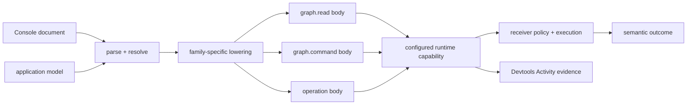

# 150. Ontahí Devtools Semantic Console

Status: current

Canonical ID: `ontahi://plans/150-ontahi-devtools-semantic-console`

Related plans:

1. [100f. Operation Invocation Capability](../done/100f-operation-invocation-capability.md)
2. [118. Ontahí Selection Language Editor](../done/118-ontahi-selection-language-editor.md)
3. [128. Ontahí Data Graph Execution Bridge](../current/128-ontahi-data-graph-execution-bridge.md)
4. [132. Durable Invocation Identity And Idempotency](../next/132-durable-invocation-identity-and-idempotency.md)
5. [145. Ordered Relations And Sequence Commands](../done/145-ordered-relations-and-sequence-commands.md)
6. [146. Ontahí Runtime Protocol](../done/146-ontahi-runtime-protocol.md)
7. [147. Application-Bound Headless Graph Reads](../done/147-application-bound-headless-graph-reads.md)
8. [148. Ontahí Devtools Runtime Inspection](../current/148-ontahi-devtools-runtime-inspection.md)
9. [150a. Selection Factories, Locators, And Refs](../done/150a-selection-factories-locators-and-refs.md)
10. [150b. Language Modules And Dialect Contract](../done/150b-language-modules-and-dialect-contract.md)
11. [150c. Ordered Read Composition](../done/150c-ordered-read-composition.md)

Related Atlas shapes:

1. [`ontahi.source-code-organization.devtools`](ontahi://atlas/source-code-organization/devtools)
2. [`ontahi.developer-experience`](ontahi://atlas/developer-experience)
3. [`ontahi.semantic-interaction-language`](ontahi://atlas/semantic-interaction-language)
4. [`ontahi.runtime-protocol`](ontahi://atlas/application-architecture-surface/runtime-protocol)

## Summary

Deliver a **Console** panel to Ontahí Devtools for semantic Graph Reads, Graph Commands, and
Operation invocations against the connected application. The Read slice is shipped; Commands and
Operation invocation are not yet implemented in the Console.

Supported today:

```text
TodoItem.where(completed = false).orderBy(title).limit(20).many()
Tag.many()
TodoItem.where(id = "todo-explorer").one()
TodoItem.where(completed = false).exists()
```

Original future-facing examples, retained as design context rather than executable syntax:

```text
TodoItem
  .where(completed = false)
  .view(TodoItemSummary)
  .limit(20)
  .many()

TodoList("inbox").items.move(
  TodoItem("todo-3"),
  before: TodoItem("todo-1"),
)

TodoList.createItem({
  list: TodoList("inbox"),
  title: "Ship the semantic console",
})
```

The syntax above is representative rather than frozen, but one constraint is decided: source does
not begin with `read`, `command`, or `invoke` keywords. The resolver infers the semantic family from
the reflected root symbol, selected members, arguments, and terminal expression. The durable product
shape is a semantic, reflection-assisted console that lowers valid documents to existing canonical
request bodies and executes them through the application's configured runtime. It is not JavaScript
`eval`, an arbitrary HTTP client, a server shell, or a privileged policy bypass.

The first visual host is the Devtools panel. Parser, resolver, and lowering are already headless.
Extracting a reusable headless Console execution/session model remains pending: current execution
coordination lives in the React panel. A future terminal CLI should reuse the same documents and
outcomes without importing React or reconstructing Ontahí semantics.

## Delivery Status — 2026-09-09

Read delivery evidence: [merged PR #148](https://github.com/javifernandes/ontahi/pull/148),
included in `main` at `cfca984`. This plan remains `current`; delivering Reads did not complete
its Command, Operation, session, or CLI scope.

| Area                            | Status                                 | Delivered or remaining                                                                                                                                                 |
| ------------------------------- | -------------------------------------- | ---------------------------------------------------------------------------------------------------------------------------------------------------------------------- |
| A. Language contract            | Partial                                | Read syntax, diagnostics, lowering, and reflection exist; three-family resolution and a headless session contract remain.                                              |
| B. Read walking skeleton        | Done for the agreed small Read surface | Filtered/unfiltered terminals, one-field ordering, limits, rich values, Visual/JSON, and source-backed table controls. Views and pagination were not delivered.        |
| 150a. Locator/Ref investigation | Done; bounded deferrals accepted       | 21 research cases; canonical identity preserved. Factory declaration details, external resolution, and Ref migration deferred.                                         |
| C. Two Read dialects            | Implemented; validation complete       | TS/Declarative selector, shared analysis, assistance, rich values, table edits, and reversible non-executing conversion.                                               |
| D. Graph Commands               | Not started                            | Targeting, authoring, confirmation, execution, and results in the Console.                                                                                             |
| E. Operation invocation         | Not started; after Commands            | Input assistance, invocation outcomes, confirmation, and durable progress links.                                                                                       |
| F. Console experience           | Partial                                | Compact results, read assistance, undo, and pending/stale/error states exist; execution history, richer disclosures, and complete session/accessibility proofs remain. |
| G. CLI projection               | Deferred                               | Headless execution proof, package decision, and separate CLI implementation plan.                                                                                      |

Deferred read extensions: named Views/parameters, nested projections, multi-field ordering, and
pagination. They are not prerequisites for research or the two-dialect proof. The original View
acceptance remains recorded below; these items must be explicitly delivered or extracted into
linked follow-ups before closing the parent plan. Additional language dialects and a standalone
CLI are likewise outside the immediate next slice.

## Context

### Read composition checkpoint — 2026-09-12

Plan 120b now provides contextual navigation in both dialects, with shared target assistance and v2
Graph Read execution. Plan 150b completed the behavior-preserving language module/dialect strategy
refactor. Plan 150c subsequently delivered interleaved source-filter/navigation composition; this
checkpoint does not implement Commands, Operations or the headless execution session.
Context-aware Reference candidates are deferred in
[118f](../backlog/118f-context-aware-reference-assistance.md), consuming dynamic population/cost
profiles from [126](../research/126-ontahi-runtime-data-reflection.md). These are not static schema
reflection or implicit execution during parsing.

Plan 148 gives Devtools an Activity stream for observing semantic runtime work after application
code initiates it. Explorer can inspect reflected structure and invoke one reflected Operation from
a generated form. The Selection language can author a contextual predicate and lower it to the
canonical Selection AST. The Runtime Protocol can already carry Operation, Graph Read, and Graph
Command bodies over HTTP, WebSocket, or process-local transports.

The original missing loop was intentional interaction. A developer who wanted to answer “does this View return
the expected TodoItems?”, “what does this ordered move do?”, or “how does this Operation reject this
input?” had to write temporary application code, find an Explorer-specific form, or assemble
a protocol request by hand. None is equivalent to a small Ontahí-native CLI embedded beside the
runtime evidence. PR #148 closes that loop for the supported Reads; the other families remain.

Historical BookOps GraphOps work is useful evidence: reflected operation forms and entity data
browsing make domain capabilities discoverable, but they are task-specific panels. A Console should
compose those capabilities through one repeatable authoring surface without collapsing Explorer's
topology/catalog role into Devtools or making a React form the semantic source of truth.

## Product Boundary

The Console has four responsibilities:

1. **Discover:** offer Entity, View, Field, Relationship, Command, and Operation assistance from an
   application model supplied by the host.
2. **Author:** preserve source text, cursor position, recoverable syntax, diagnostics, and explicit
   user intent.
3. **Execute:** lower one valid expression to one existing family request and send it through the
   configured runtime capability.
4. **Explain:** show the semantic result or rejection, duration, selected transport, and correlated
   Activity evidence without reducing everything to raw JSON.

It does not own:

1. Entity, Query, Command, Operation, policy, or Runtime Protocol semantics;
2. authentication or authorization decisions;
3. server-side reflection policy;
4. transport routing state;
5. Explorer's application-topology and catalog experience;
6. arbitrary JavaScript, filesystem, process, database, or network execution.

## Proposed Form

### One Console, Three Existing Families



The Console is not a new Runtime Protocol family. Semantic resolution determines whether an
expression denotes a Query terminal, a Graph Command, or an Operation invocation, and its lowerer
produces that family's canonical portable body. Family names are execution metadata shown by the UI,
not leading source keywords. The ordinary dispatcher, parser, policy, authority context, and
executor remain authoritative on the receiver. Transport envelopes and receiver context are not
editable source language.

The first language should support one expression per execution. Multi-expression scripts,
transactions, pipes, variables, loops, and background jobs require separate semantics and are not
implied by a visual terminal metaphor.

### Authoring Model

The editor should behave like a semantic expression entry rather than a raw JSON textarea:

1. completions come from grammar plus reflected application facts;
2. hover or inline help explains the selected Entity, View, Relationship, Command, or Operation;
3. syntax and semantic diagnostics block execution before a request is sent;
4. execution failures, policy rejections, and transport failures remain separate from editor
   diagnostics;
5. `Mod-Enter` executes the current valid expression;
6. formatting preserves or deliberately rewrites one text document rather than mutating hidden form
   state;
7. an optional generated/portable-body view explains the exact family body but is not the primary
   editor in the first slice.

The language capability must not grow one universal “Console AST” that duplicates Query, Selection,
Command, Operation, or protocol types. A small recoverable expression syntax owns member access,
calls, arguments, incomplete input, and source ranges. Semantic resolution binds those nodes to
reflected Ontahí symbols and thereby discovers the family; valid meaning then lowers into the
existing family-owned representations.

### Graph Reads

The Read form should cover a useful vertical slice before attempting a complete textual Query DSL:

1. Entity and cardinality (`many`, `first`, `one`, `count`, or `exists`);
2. an optional named View and its parameters;
3. an optional `where` expression using the existing Selection language;
4. explicit ordering, pagination, and limit only where the canonical Graph Read model already has
   truthful portable semantics;
5. an explainable result that preserves Entity identity and View shape.

The first walking skeleton should be a self-contained textual expression. The UI may later project
reflected structural controls into that source, as the Selection editor does for finite values, but
it must not keep a hidden family selector or other execution meaning outside the document. Every
projection must produce the same canonical Graph Read body and remain usable through a headless
adapter.

### Graph Commands

The Command form should discover and author the Commands the reflected application and runtime can
actually support:

1. exact Entity create, update, and delete where those Commands are public and portable;
2. direct Relationship attach, detach, replace, and clear;
3. many-to-many link and unlink;
4. ordered Relationship placement and move using `before`, `after`, or `at`;
5. optimistic preconditions when the underlying Command declares them.

The original Command proposal uses canonical Entity Refs and reflected Relationship facts. Plan
150a now gates the authoring model; it does not yet change the existing portable Command contract. The receiver
must still parse the portable Command body and enforce policy. A missing editor affordance is not a
denial, and a visible completion is not authorization.

### Operation Invocation

The Invoke form should select a reflected executable Operation, assist input construction from its
contract, and submit the ordinary versioned Operation request. Permission preflight may improve the
UI but never substitutes for invocation-time authorization. The result view must preserve the
canonical distinctions among success, invalid input, policy rejection, expected failure, unexpected
failure, and transport/protocol failure.

Durable Operations should return and link to their existing Task/run identity and progress evidence.
The Console does not create a parallel durable lifecycle or wait language in the first slice.

### Results And History

The following remains the full experience target, not a list of shipped UI. Today the Console has
Visual/JSON result values and compact duration/limit controls, but not a request/envelope inspector,
an Activity deep-link, or execution history. Source undo/redo is not execution history.

The visual panel should contain:

1. an expression editor with assistance and a clear execution action;
2. a result region with semantic, portable-body, and raw-envelope progressive disclosure;
3. family, status, duration, selected transport, and correlation metadata;
4. a direct path to the matching Activity detail when diagnostics are enabled;
5. bounded, session-local source history;
6. keyboard navigation, accessible status announcements, and a usable narrow layout.

Selecting history restores source only. It never executes automatically. Reads may be executed again
through the ordinary explicit action. A previous Command or Operation is historical source, not an
idempotent replay token; executing it again is a new user-initiated effect and must use the configured
confirmation policy. Automatic retry, replay after ambiguous failure, and one-click mutation replay
remain outside this plan until invocation identity and idempotency semantics are truthful.

## Headless Ownership And Integration

The intended first boundary reuses existing packages instead of creating a Console-only semantic
stack:

1. `@ontahi/language` owns editor-neutral expression parsing, recovery, diagnostics, reflection-shaped
   assistance, formatting, and family-specific lowering. Existing Selection parsing remains a
   nested semantic service rather than copied grammar.
2. `@ontahi/language-codemirror` projects that service into the browser editor. It owns CodeMirror
   integration, not runtime execution.
3. `@ontahi/devtools` owns a headless Console session model: source/history lifecycle, execution
   state, outcome classification, cancellation/abort wiring, and correlation with diagnostics.
4. `@ontahi/devtools/react` owns the panel, layout, controls, result rendering, and accessibility.
5. The host supplies a narrow application model plus executable Read, Command, and Operation ports
   backed by its ordinary clients and configured Runtime Transport. Devtools does not import a
   server runtime, storage provider, or Explorer React contract.

These package assignments are the starting hypothesis. The first execution slice may extract a
smaller shared headless package if a concrete terminal CLI proves that `@ontahi/devtools` is the
wrong dependency direction; the plan should not create that package preemptively.

The browser panel uses the same authenticated host session and the same effective transport routing
as application code. A future CLI may bind the same execution ports to Fetch, WebSocket, or
process-local transport and choose its own authentication adapter. CLI formatting, prompts, config
files, shell completion, and credential storage are adapter work, not part of the semantic engine.

## Application Model And Reflection

The Console needs more authoring context than the current contextual Selection editor, but it must
not depend on Explorer UI descriptors or assume all intrinsic schema is executable under the active
authority.

Define a narrow, framework-owned Console application model that can describe:

1. Entities, identities, Fields, scalar/value types, and named Views;
2. Relationships, cardinality, ordering, and available canonical Command forms;
3. Operations, input/output contracts, destructive/effect classification where declared, and
   Durable metadata;
4. family/runtime capability availability;
5. optional documentation and deprecation facts.

The host may initially project this from generated client metadata and static reflection. Runtime
Data Reflection can later narrow or enrich it with authority-aware capability and reference-value
lookup. The model drives assistance only. The receiver remains the enforcement boundary even when
the model is stale, broader than current authority, or unavailable.

## Safety And Policy

1. The Console is mounted only when the host explicitly includes Devtools and enables this panel.
2. Production inclusion and mutable execution controls require an explicit host choice.
3. Portable requests never contain client-authored authority, trusted actor, role, or receiver
   context.
4. Runtime handlers apply the same authentication, policy, validation, limits, telemetry, and
   transport rules as ordinary application calls.
5. Statement and result retention is bounded and in-memory by default. Redaction occurs before
   diagnostic or history storage.
6. Mutation and Operation submission is an explicit action with a host-configurable confirmation
   policy; destructive declarations should inform the default UI but are not security enforcement.
7. No automatic retry occurs after an ambiguous transmission or execution outcome.
8. There is no arbitrary JavaScript evaluation, dynamic module import, raw SQL, shell command,
   unrestricted URL fetch, header/cookie editor, or raw Runtime Protocol envelope sender.
9. Unsupported families, unavailable handlers, stale reflection, and policy rejection fail visibly
   rather than falling back through another path.

## Scope

1. Specify the one-expression semantic document and reflection-driven family-resolution boundary.
2. Provide reflection-assisted authoring and lowering for a useful Graph Read, Graph Command, and
   Operation vertical slice.
3. Add a headless Console session and execution port contract.
4. Add the Devtools Console panel and integrate it with effective Runtime Transport routing.
5. Correlate Console outcomes with Activity evidence when the diagnostic decorator is present.
6. Add bounded, redacted, session-local source history.
7. Prove the three families in the Todo example, including one ordered Relationship move.
8. Preserve a DOM-free boundary that a terminal CLI can consume later.

## Non-Goals

1. No JavaScript REPL, Node/browser console replacement, shell, raw SQL runner, or arbitrary HTTP
   client.
2. No new Runtime Protocol family, envelope, Graph Read model, Command model, Operation model, or
   authorization path.
3. No general-purpose scripting language, variables, loops, pipes, transactions, or multi-expression
   atomicity.
4. No automatic mutation retry, background execution, replay, batch runner, or saved executable
   macro.
5. No server-side admin bypass, service-role selector, credential editor, or policy impersonation.
6. No requirement to complete all Query syntax, relation predicates, dynamic reflection, or an LSP
   before the first walking skeleton.
7. No replacement for Explorer's application catalog/topology, generated typed application code, or
   normal product UI.
8. No standalone CLI binary in the first visual slice; only its reusable headless semantic and
   execution boundary.
9. No persistent or synchronized source history in the first slice.

## Execution Slices

### Revised Sequence — 2026-09-09

The Read Console shipped in PR #148. Before adding mutable syntax, the agreed next order is:

1. [150a. Selection Factories, Locators, And Refs](../done/150a-selection-factories-locators-and-refs.md):
   investigate whether Selection subsumes the original locator responsibility, and what identity
   or reference guarantees still require a distinct representation. Do not freeze `refByX` in the
   language or assume Ref removal before testing the alternatives.
2. Prove two read-only dialects while the language is small: the existing TS-like fluent surface
   and a declarative surface. Both target the same canonical Read/Selection values.
3. Prove [120a's named Selection factories](../done/120a-pure-named-selection-factory-contract.md) before
   freezing mutable targeting syntax. This bounded proof is complete: Core, discovery/codegen/inspection,
   and Console factory intersections plus `where` are implemented. Union/grouping and broader factory
   extensions remain deferred in Plan 120.
4. Harden consumer cardinality/read shaping in 116a, then add Graph Commands.
5. Add Operation invocation.

The following A/B sections retain the original walking-skeleton scope and history. The research
gate is closed: start read-only dialects without factory implementation or Ref migration. Named
Views remain deferred, not a prerequisite for the two-dialect proof; the original View acceptance
item below remains future scope. Console experience and CLI follow-ups are retained.

### A. Contract And Syntax Gate

Status: partial; the Read boundary is established, not the complete three-family contract.

- [x] Define self-contained keyword-free Read grammar, reflection-based resolution, and headless
      diagnostics/lowering over the existing Selection algebra.
- [x] Cover Todo and independent Entity fixtures; reject unsupported/incomplete Read syntax.
- [ ] Complete the cross-family contract and representative Command/Operation documents after 150a.
- [ ] Define headless execution outcomes and source-history/session contracts independent of React.

### B. Read Walking Skeleton

Status: shipped for the agreed small surface in PR #148. The original expanded View/pagination
scope is separately pending rather than included in the completion claim.

- [x] Parse/resolve Entity and optional `where`, reusing the exact Selection grammar.
- [x] Support filtered/unfiltered `many`, `first`, `one`, `count`, and `exists`.
- [x] Lower one-field ordering and explicit non-negative limits where the terminal supports them.
- [x] Execute canonical Graph Reads through configured Runtime Transport and receiver policies.
- [x] Render tables, individual/scalar results, and JSON with compact timing and limit controls.
- [x] Reuse Boolean/enum rich values, completion, highlighting, lint, and `Mod-Enter`.
- [x] Reflect table sort/limit changes into undoable source edits and execute through the receiver.
- [x] Use receiver ordering capabilities in both headers and autocomplete.
- [x] Preserve successful snapshots during edits, pending requests, and failures; show precise
      cardinality/ordering errors and ordinary transport errors.
- [x] Produce ordinary Activity evidence through the host's instrumented transport.
- [ ] Add named Views/parameters and nested projection, if retained after the design gate (deferred).
- [ ] Add pagination and multi-field ordering (deferred).

### C. Read-Only Dialect Experiment

Status: implemented; headless and editor/Console proofs complete after the accepted 150a gate.

Representative equivalence in the headless slice:

```text
TodoItem.where(completed = false).orderBy(title).limit(25).many()

TodoItem where completed = false order by title ascending limit 25
```

- [x] Cover only the currently supported reads: predicates, ordering, limit, and `many`, `first`,
      `one`, `count`, `exists`. Define terminal spelling and any default explicitly before coding;
      omitted terminals must not introduce hidden execution meaning. Do not add SQL semantics.
- [x] Require both dialects to lower equivalent valid documents to the same canonical request,
      including defaults and cardinality. A dialect must not inherit JavaScript or SQL coercions.
- [x] Prove parse/render/parse semantic round-trips, including reserved-word Entity/Field names,
      quoted values, Boolean precedence, and diagnostics for unsupported constructs.
- [x] Switching dialect must not execute. Define handling for invalid/incomplete drafts, comments,
      undo, and source trivia; never silently replace a draft with an older valid model.
- [x] Reuse finite-value controls and the source-backed table sort/limit interaction in each dialect.
      Request lowering, receiver capability hints, and authorization must remain shared.
- [x] Use headless adapters first; no new universal AST, language-runtime eval, CLI binary, or generic
      dialect plugin framework. Additional Java/Python/.NET-like surfaces remain future possibilities.

#### C1. Headless Dialect Contract

`Entity [where predicate] [order by Field [ascending|descending]] [limit number] [terminal]`.
Terminal is `many` by default, or explicit `many`, `first`, `one`, `count`, `exists`. Ordering defaults
to ascending; display limit remains the supplied host default (25 otherwise). Omission never runs
anything: analysis only constructs the existing request. Current terminal/modifier restrictions,
Selection precedence, types, nullability, and receiver authority remain unchanged.

The shared Lezer grammar has a third top rule, not a regex-to-TS preprocessor. Both recovered forms
use the same reflection resolver and request lowering. `convertConsoleDocument` prints validated
authoring structure, retaining `exists` versus `first` even when their wire bodies coincide. It
rejects empty/invalid drafts instead of using stale valid state. Conversion preserves predicate
spelling/grouping; outer whitespace is formatted. Comments are not supported and therefore block
conversion rather than being dropped. Same-dialect conversion preserves the full source.

#### C2. Editor And Console

The Console exposes TS/Declarative controls beside Run, with dialect-aware CodeMirror parsing,
completion, lint, rich Boolean/enum values, and source-backed sort/limit edits. Switching does not
execute; CodeMirror stores source and dialect together in history and restores original trivia on
undo. Invalid drafts block conversion with a tooltip and existing diagnostics; empty drafts switch
unchanged. Comments remain unsupported rather than silently discarded. `initialDialect` optionally
selects the initial Console form; TS and the contextual Explorer Selection remain unchanged defaults.

Results retain executed meaning during switching and pending reads. Canonical request equality plus
the `exists` presentation intent determines whether the current draft matches the successful
snapshot; equivalent conversion does not claim a new execution or falsely show a stale result.
Table controls and completion share existing receiver capability hints in both dialects.

#### C2 Verification — 2026-09-09

- Language: 204 tests; CodeMirror: 45 tests; Devtools: 75 tests, all with coverage thresholds passing.
- Added proofs for clause/Selection completion, ordering capability hints, minimal source edits,
  parser and history restoration, rich values, invalid/empty drafts, initial dialect, pending
  `exists` results, and real receiver-backed sorting/limits in declarative mode.
- All three packages pass build, typecheck, and lint. The Todo browser bundle builds.
- `pnpm verify:artifacts -- --skip-build` passes clean-room install, type, and runtime checks with
  the rebuilt Language, CodeMirror, and Devtools artifacts.
- Browser smoke in the local in-memory Todo: converted to Declarative without a new Activity entry,
  ran the filtered read, sorted via the title header, then changed limit to two. Source, Activity,
  and two visible result rows agreed; the Boolean control remained rich. Inspected actual rendering.

#### C3. Shared Authoring Preference And Syntax Contrast

- [x] Add a browser-origin preference in Devtools Settings, observable by mounted editors and
      other same-origin tabs. Keep it separate from runtime authority and use page-local fallback
      when storage is unavailable. Server calls are inert.
- [x] Preserve the Console editor, draft, result, and undo history while visiting Settings or
      Activity. Convert valid drafts without execution on preference changes; retain incomplete
      drafts with a notice. The local Console switch does not overwrite the saved preference;
      an explicit host `initialDialect` overrides it.
- [x] Share the preference with Explorer Selection editors without inventing new predicate or
      plain-text search semantics: contextual predicates already have identical syntax in both
      dialects. Their help identifies the preferred dialect.
- [x] Replace generic syntax colors with dedicated light/dark palettes for both dialects and
      contextual Selection editors. Follow the resolved Explorer theme and the dark Console.

Verification on 2026-09-09: Language 204, CodeMirror 55, Devtools 79, and Explorer 189 tests pass
with coverage thresholds. New tests cover preference persistence/notifications/restricted storage/SSR,
Settings navigation and undo, invalid draft preservation, saved defaults and host overrides,
Explorer theme reconfiguration, and keyword tokens in both dialects. Every token color exceeds
4.5:1 contrast against the tested light/dark editor surfaces. All three touched UI packages pass
build, typecheck, and lint; the Todo client builds (existing chunk-size warning). The user reports
having tested manually; no additional assistant browser smoke is claimed for C3.

`pnpm verify:artifacts -- --skip-build` also passes clean-room installation, type, and runtime
checks with rebuilt artifacts. The network-restricted attempt was stopped after npm resolution
failed; the successful run used authorized network access.

#### C3 Follow-up: Fixed-Light Todo Host

The Todo host uses a fixed light CSS palette but omitted `ExplorerProvider.theme`, so the editor
followed a dark OS preference and displayed light tokens on a light background. A consumer test
mounting the real provider/editor with a dark system preference reproduced the exact pale Field
color from the reported screenshot. The host now explicitly supplies `theme='light'`; computed
Field/operator colors and the rich Boolean value pass without changing Console's dark palette.
Focused Todo Explorer tests (4), codegen check, server/client typechecks, lint, and client build pass.
The full Todo suite also passes (67 tests) with authorized local-server access; the sandboxed run
could not complete its OAuth/application server tests.

#### C3 Follow-up: Chained Ordering Completion

Accepting `order by` closed CodeMirror completion without offering the next Field, even with known
ordering capabilities. A regression reproduces that exact accepted-completion transaction; the
adapter now reactivates completion for ordering/predicate clauses in both dialects. Receiver-owned
Field filtering remains intact. The initial follow-up explained missing permissions by asking for
a first successful read; user feedback rejected that dependency. The metadata-only discovery slice
below replaces that temporary UX.
Verification: CodeMirror 57 and Devtools 88 tests pass with coverage thresholds, including both
accepted-ordering dialects and receiver-backed declarative completion before/after the first read.
Both packages pass typecheck, lint, and build; the Todo client rebuild passes with the existing
chunk-size warning. Formatting and whitespace checks pass.

#### C3 Follow-up: Independent Ordering Discovery And Rich Controls

- [x] Add `graph-read-capabilities` to the existing graph.read family: Entity policy metadata,
      trusted scope validation, no Query execution or select-all prerequisite.
- [x] Support Runtime Protocol HTTP/WebSocket and standalone Express/Next.js read adapters.
- [x] Discover on reflected Entity selection, even with an incomplete draft; share the result
      between autocomplete, Field/direction dropdowns, and headers.
- [x] Distinguish loading, empty policy, and error/retry without running data queries.
- [x] Invalidate on Entity, transport, graph.read routing, and host identity changes; ignore late replies.
- [x] Reuse finite-value widgets for both dialects, with ordinary source edits, undo/redo, Escape,
      deletion, and an implicit ascending direction that does not mutate source just by rendering.

Metadata is advisory, never authorization of a particular Query. The host now supplies
`console.identity` using the existing ExecutionIdentity principal/cacheScope contract (wired in
Todo). Authority changes invalidate metadata, clear previous Console results, and cancel pending
reads while preserving the editor and undo history. Late metadata/results/errors cannot restore
the previous authority's state. Hosts must signal tenant/role/policy changes through cacheScope;
unreported cookie or server policy changes cannot be inferred. Execution remains authoritative
and a denial refreshes metadata. Within one identity, results retain their snapshot/Run semantics.

PR review follow-up: mounted Console regressions cover principal/cacheScope changes, open
autocomplete invalidation, updated headers, preserved editor, equivalent-identity rerenders, and
late data successes/errors (including switching back). All 97 Devtools tests pass with coverage.
CI's Node 20/24 failures were 5-second UI timeouts; the new Console/Settings/Activity suites now use
the same 15-second integration budget as the existing mounted Devtools tests, without retries,
skipped assertions, or a global unit-test timeout increase.

Verification: Core 916, Devtools 91, Express 44, Next.js 51, and Todo 68 tests pass. CodeMirror's
expanded coverage suite exercises incomplete clauses, implicit direction, source reveal, undo,
permission reconfiguration, and deletion through rich controls. Devtools, CodeMirror, and Next.js
coverage gates pass. A real-browser smoke verifies pre-Run discovery, permitted Field/direction
choices, unchanged results until Run, descending execution, and TS/Declarative conversion.
Affected packages and Todo pass build/typecheck/lint; packed artifacts pass clean-room install,
types, and runtime checks. The Todo client retains its existing large-chunk build warning.

#### C4. Activity Read Projection

- [x] Apply the saved dialect to existing Graph Read Activity list titles, detail headings,
      Selection/ordering cards, and filtering—not only CodeMirror editors.
- [x] Derive labels directly from captured canonical data with pure formatters and a React
      presentation context. Keep payloads, Body JSON/Envelope copying, results, and traffic intact.
- [x] Preserve nested declarative predicate grouping and captured cardinality. Do not infer
      `exists` from nullable `get`; retain View/multi-order/redacted diagnostic information even
      when outside the executable Console grammar.
- [x] Keep Command and Operation labels unchanged until their dialects are defined.

The regression first failed because Activity retained fixed TS summaries after changing Settings.
The passing focused proof covers all three summary locations, Selection, filtering, live preference
changes, unchanged captured payloads/JSON/envelopes, and no extra request or CodeMirror instance.
Pure tests also cover nested predicates, null/membership, incomplete captures, Views, ordering, and
read modes.

C4 verification on 2026-09-09: all 86 Devtools tests pass with coverage thresholds. The 12 focused
Activity tests also pass after the final formatter adjustment. Devtools build, typecheck, lint,
changed-file formatting, and Todo client build pass (existing chunk-size warning). No new browser
smoke or package export was added in this slice.

#### C1 Verification — 2026-09-09

- Language: 51 new dialect cases; full suite 189 tests passes, including coverage thresholds.
- Existing consumers: CodeMirror 42 tests and Devtools 70 tests pass with the rebuilt language.
- Language typecheck, lint, and build pass; changed-file formatting and plan links checked.
- `pnpm verify:artifacts -- --skip-build` passes clean-room installation, type, and runtime checks
  after rebuilding Language. The first sandboxed attempt could not reach npm; the successful retry
  used authorized network access. No new UI, live dialect switching, or cross-provider runtime
  behavior is claimed by these checks.

### D. Graph Commands

Status: not started; 120a's factory/Read-language proof is complete; 116a cardinality hardening is next.
The agreed sequence now validates deferred Selection authoring before exposing mutable syntax;
legacy locators remain compatible until representative consumers prove a replacement.

- [ ] Add exact Entity mutation and Relationship Command discovery from the application model.
- [ ] Lower direct, many-to-many, and ordered forms to the existing versioned Command body.
- [ ] Preserve typed preconditions and Command results.
- [ ] Prove attach/detach plus ordered `move before|after|at` in Todo.
- [ ] Require explicit submission/confirmation; never retry through transport ambiguity.
- [ ] Choose targeting syntax from the completed model gate, not by copying generated TS methods.

### E. Operation Invocation

Status: not started; after Commands. Existing invocation elsewhere in Ontahí does not complete
Console invocation.

- [ ] Add Operation discovery, contract-driven input assistance, and validation diagnostics.
- [ ] Lower to the canonical versioned Operation request.
- [ ] Preserve permission preflight and invocation-time authorization as distinct outcomes.
- [ ] Render every canonical invocation result and link Durable acceptance to Activity/run progress.
- [ ] Require explicit confirmation according to the configured effect/destructive policy.

### F. Console Experience

Status: partial; read usability shipped, broader session experience remains.

- [x] Deliver Read completion, positioned syntax/semantic diagnostics, rich finite values,
      `Mod-Enter`, source undo/redo, and a resizable Devtools host.
- [x] Deliver Visual/JSON result values, compact elapsed time/limit controls, and pending/stale/error
      presentation without redundant query or success panels.
- [ ] Complete hover/help and deliberate formatting for the supported dialects/families.
- [ ] Add optional request/body/envelope disclosure and a direct Activity correlation link without
      reclaiming the table's space for redundant metadata.
- [ ] Add bounded, redacted execution history with restore-only selection.
- [ ] Extract the headless execution/session lifecycle, including abort and retention policy.
- [ ] Complete keyboard, screen-reader, focus, and narrow-layout verification across families.
- [ ] Extend and verify capability-unavailable states for Commands, Operations, and diagnostics;
      the Read slice already reports missing transport, invalid source, and execution failures.

### G. CLI Projection Follow-Up

Status: deferred; the language boundary exists, but there is no complete headless Console session
or standalone CLI proof.

- [ ] Prove the headless language and Console session APIs in a small non-React harness.
- [ ] Decide whether a standalone CLI belongs in `@ontahi/devtools`, a new package, or a host tool
      after real authentication and configuration requirements are known.
- [ ] Specify terminal input/output, config discovery, transport selection, credential handling, and
      non-interactive exit codes in a separate implementation plan.

## Implementation Checkpoint

Checkpoint 2026-09-08, Graph Read walking skeleton:

1. The existing Lezer grammar now exposes independent `SelectionDocument` and `ConsoleDocument`
   top rules while sharing the exact `OrExpression` Selection productions.
2. `@ontahi/language` parses and resolves the first self-contained keyword-free expressions,
   `Entity.where(Selection).many()`, nullable `Entity.where(Selection).first()`, and exact-cardinality
   `Entity.where(Selection).one()`, plus their unfiltered `Entity.many()`, `Entity.first()`, and
   `Entity.one()` forms, and lowers them to canonical `GraphReadRequestV1` bodies. An omitted
   `.where(...)` resolves to the canonical `all` Selection. Filtered and unfiltered `.count()`
   terminals use the canonical count mode without row cardinality or limit.
3. Many reads accept `.limit(nonNegativeInteger)` before their terminal and lower that source value
   to the canonical request limit; combinations with `first()`, `one()`, `count()`, or `exists()` are rejected
   as meaningless.
4. Core Entity definitions can be projected into the existing narrow Selection reflection input;
   Entity and nested Field completions remain headless.
5. `@ontahi/language-codemirror` exposes the Console parser, completion, lint, highlighting, and
   `Mod-Enter` execution extensions without copying Selection semantics. Its nested Selection also
   reuses the source-backed finite-value projections for Boolean and enum literals.
6. `@ontahi/devtools/react` exposes an opt-in Console panel that submits the lowered Read through
   the configured Runtime Transport, renders the result through shared Visual or JSON projections,
   preserves structured exact-one cardinality feedback, and produces ordinary Activity evidence.
7. Todo supplies its generated Entity schemas and starts with
   `TodoItem.where(completed = false).many()` as the browser proof.
8. `.orderBy(field[, asc|desc])` reuses canonical Graph Read ordering, with one reflected scalar
   Field and ascending as the default. The grammar orders `where`, `orderBy`, `limit`, then the
   terminal. Ordering is supported for `many`, `first`, and `one`, not `count` or `exists`.
9. Visual many-result headers and source are projections of that same Query. Header actions cycle
   ascending/descending/none, apply source-range edits in one undoable CodeMirror transaction, and
   explicitly execute through Runtime Transport. No client-side row sorting or hidden sort state
   is introduced. Text editing and Undo do not run automatically.
10. Results retain the successful execution's source and canonical request. Arrows describe that
    snapshot; draft changes, pending reads, and failures do not rewrite the old result. Invalid,
    other-Entity, non-many, and in-flight drafts disable table actions. Valid same-Entity drafts
    retain their filters and limits when a header action submits them.
11. The read-ordering slice is covered by headless lowering/source-edit tests, CodeMirror finite
    projection/deletion tests, and Devtools integration against the real in-memory read dispatcher
    (ordering before limit, policy rejection, Undo, pending edits, transport failure, empty rows).
12. Ordering-only policy rejections now preserve `access_denied` and report the requested Entity
    and Field with optional structured `ordering_not_allowed` details. Console displays the
    receiver's precise message while retaining the successful result snapshot. Unknown policies
    and other denials remain generic; no permissions are broadened.
13. Console discovers ordering metadata independently via `graph-read-capabilities`, without data
    execution; ordinary Graph Reads retain their optional inline capabilities. The receiver derives
    Field names from policy, including derived dependencies. Headers intersect these names with intrinsic scalar types;
    denied headers explain the policy restriction without editing or sending requests. Missing
    or malformed metadata disables ordering, with metadata retry available. Transport/routing changes
    and policy denials refresh discovery. Old table results require a Run on the current transport.
    Capabilities are advisory snapshots; every read remains authorized anew.
    `orderBy(...)` autocomplete consumes the same Entity/transport-bound snapshot, excluding denied
    Fields and offering none when capabilities are unavailable. An optional headless completion
    resolver narrows assistance without restricting manual authoring or changing query semantics;
    CodeMirror reconfiguration drops stale suggestions without changing source or history.
14. Visual many-result limits are editable with Apply/Enter. The headless `editConsoleLimit` helper
    inserts or replaces only the limit's source range, preserving filters, ordering and trivia in
    one undoable transaction. Textual changes reflect after Run; pending/failing requests retain
    the executed limit and results. Invalid/other-Entity/non-many drafts and replaced
    transports disable the control. Zero is supported; server maximum policy remains unchanged.
    Pagination and total counts are not inferred from this control.
15. Result chrome is compacted into one toolbar with last successful round-trip duration, limit
    and Visual/JSON. The duplicate query disclosure, success message and row/limit summary are
    removed. Apply appears only for a changed numeric draft; stale/pending notices are inline and
    errors remain actionable. Timing belongs to the successful snapshot, not a pending/failed read.
16. Filtered and unfiltered `exists()` lower to nullable `get` with `limit: 1`, independent of the
    Console display limit, matching the application Graph Read intent. The Console projects only
    successful record/null results to Boolean in Visual/JSON; policy, transport and malformed
    response failures remain errors. Projection is tied to the submitted source, not an in-flight
    draft. Completion, highlighting and rich Selection values reuse the shared language. No
    protocol mode, permission, ordering, or display-limit control is added for existence reads.
17. Multiple ordering Fields, named Views, other Query terminals/members,
    source history, Commands, Operations, full reflection
    delivery, and the terminal CLI remain later slices of this plan.
18. PR review hardening preserves the eight Console member words as contextual identifiers in
    Selection Fields and Entity names, covers implicit get-cardinality error mapping, and adds
    execution-shortcut/unresolved-projection coverage without lowering coverage thresholds.
    Analysis diagnostics and result rendering are split by responsibility; result controls and
    status use native accessible elements without adding UI chrome.

## Acceptance Checklist

Checked items describe the shipped Read surface only. Cross-family and session guarantees remain
unchecked until exercised in those paths; existing runtime capabilities elsewhere are not Console
delivery evidence.

- [x] A developer can author and execute supported filtered/unfiltered Graph Reads from the Console.
- [x] Read documents resolve without leading family keywords or a hidden family selector and lower
      to canonical `GraphReadRequestV1`, with no new protocol family or authority field.
- [x] Read syntax/semantic diagnostics are distinct from receiver and transport failures; structured
      cardinality and ordering rejection messages survive to the result panel.
- [x] Reflection drives Read assistance; receiver policies authorize every execution. Headers and
      autocomplete share receiver-provided ordering capability hints.
- [x] Reads use the configured Runtime Transport and appear in ordinary Activity when the host
      instruments that transport; the Console does not create another diagnostic stream.
- [x] Read controls preserve successful snapshots, prevent pending duplicate submissions, and
      require fresh capabilities after the transport changes.
- [x] Visual/JSON results, finite-value widgets, and bidirectional sort/limit source editing work
      with ordinary undo and explicit execution.
- [x] Parser, resolver, lowering, and source-edit helpers have headless tests.
- [x] CodeMirror/React tests cover Read execution, result kinds, rich editing, pending/stale/error
      states, shortcuts, and ordering/limit capability guards.
- [x] Todo has the opt-in Read Console integration and a browser smoke proof.
- [x] The shipped Read grammar cannot evaluate arbitrary JavaScript, run shell/SQL, fetch arbitrary
      URLs, edit credentials, or submit raw authority/context.
- [x] The Locator/Ref research records an explicit decision or bounded deferral before mutable
      syntax is implemented.
- [x] TS-like and declarative Read documents preserve equivalent canonical requests, semantic
      round-trips, rich controls, and non-executing, non-destructive dialect switching.
- [ ] A developer can author and execute a Graph Command, including an ordered Relationship move
      in Todo, from the Console.
- [ ] A developer can invoke an Operation from the Console and inspect its canonical outcomes.
- [ ] Command/Operation resolution remains keyword-free, lowers only to canonical family bodies,
      and preserves the same authority, policy, validation, and transport boundaries as ordinary
      application calls. Extend the no-eval/no-raw-authority guarantee to these new forms.
- [ ] Command/Operation diagnostics distinguish editor errors, policy rejection, application
      outcomes, protocol failures, and transport failures without silent fallback.
- [ ] All three families preserve ordinary Activity correlation and transport switching without
      migrating or replaying active work; unknown families and unavailable handlers fail visibly.
- [ ] A filtered View-backed Read is proved or explicitly moved to a linked follow-up before
      parent closure (deferred; not a prerequisite for dialects or Commands).
- [ ] A previous Command or Operation never executes merely because history is opened, selected, or
      restored.
- [ ] Commands and Operations require explicit submission and follow the configured confirmation
      policy; ambiguous failures are never retried automatically.
- [ ] History and diagnostics are bounded, session-local by default, and redact before retention.
- [ ] A headless Console session and its tests cover abort, concurrency, retention, and restore
      without DOM or React; parser-only headless tests do not satisfy this item.
- [ ] React tests extend to confirmation, history safety, mutable result kinds, and all
      capability-unavailable states, with complete keyboard/accessibility/narrow-layout coverage.
- [ ] Browser integration tests prove Read, Invoke, and ordered Command flows against Todo over the
      planned HTTP/WebSocket matrix; the Read smoke proof is not that complete matrix.
- [ ] Mutable production inclusion and opt-in execution rules are explicit and documented, beyond
      the shipped Read Console's explicit host configuration.

## Verification

### Delivered Read Evidence

[PR #148](https://github.com/javifernandes/ontahi/pull/148) merged after
[CI run 34291790051](https://github.com/javifernandes/ontahi/actions/runs/34291790051) passed on its
final branch head `0b64b25`: Node 20 tests, Node 24 tests with coverage, example tests, formatting,
lint, builds, typecheck, and clean-room package artifact checks. Sonar and CodeQL passed as well.
The detailed Read implementation and browser smoke observations are retained in the checkpoint.

This merged-CI evidence covers the original Read slice. The later local dialect implementation,
automated checks, and browser smoke are recorded separately in C1/C2 above, not claimed as a new
full CI run. Mutation, execution history, and headless session paths remain unimplemented.

### Remaining Verification Contract

1. Golden syntax/diagnostic cases for complete, incomplete, invalid, and unsupported documents.
2. Lowering conformance fixtures comparing Console output with canonical family parsers.
3. Headless Console session tests for abort, concurrent submission prevention, outcome
   classification, redaction, retention bounds, and history restore.
4. Runtime adapter tests proving active routing, receiver-derived authority, rejection behavior,
   no automatic fallback, and diagnostic correlation.
5. React component tests for completion, execution, confirmation, result disclosure, history,
   focus, accessibility, and narrow layout.
6. Todo browser tests over both HTTP and supported WebSocket routing profiles.
7. Package typecheck, lint, formatting, tests, builds, Changeset status, and clean-room artifact
   verification for every changed public package.

## Decisions

1. The product is an Ontahí semantic Console, not a JavaScript or protocol-envelope console.
2. `read`, `command`, and `invoke` are not source keywords. Reflection-driven semantic resolution
   infers the existing family from the expression root, members, and terminal meaning.
3. Source text is authoring truth. Canonical Core and Runtime Protocol values are execution truth.
4. The language service is headless; CodeMirror and the Devtools panel are adapters.
5. The browser panel ships first, while the boundary remains reusable by a later terminal CLI.
6. Devtools consumes a narrow framework application model and executable ports, never Explorer UI
   contracts or server storage/runtime internals.
7. Reflection supplies intrinsic assistance and capability hints; only receiver policy authorizes
   execution.
8. Activity observes Console traffic exactly as ordinary application traffic; Console does not
   create a second diagnostic channel.
9. History restores source and never implies replay. A repeated effect is a new explicit invocation.
10. Multi-expression scripts, transactions, and persistent macros wait for their own semantic model.
11. After the Read walking skeleton, investigate Locator/Ref simplification, then prove TS-like and
    declarative Read dialects, then add Commands, and finally Operation invocation. A dialect is a
    projection of Ontahí semantics, not the language used to implement its host or CLI.

## Open Questions

1. Given the shipped TS-like Read chain, what declarative terminal spelling/defaults preserve its
   meaning, and how can switching dialect preserve incomplete authoring without executing?
2. Which framework-owned reflection projection supplies the first complete Console application
   model: generated client metadata, static application reflection, Runtime Data Reflection, or a
   deliberate composition?
3. How should a Read select nested projection when a named View is unavailable without prematurely
   designing a complete Query language?
4. Should write confirmation be always-on in Devtools, driven by reflected effect/destructive
   metadata, or supplied as an explicit host policy?
5. Which correlation receipt should ordinary family clients expose so Console can deep-link to
   Activity without coupling execution to the diagnostic store?
6. Which mutation replay affordances, if any, become safe only after Plan 132 establishes invocation
   identity and enforceable idempotency?
7. Does a real terminal proof justify a separate headless Console package, or are
   `@ontahi/language` plus `@ontahi/devtools` the correct reusable boundary?
8. How should a standalone CLI acquire host configuration and credentials without turning the
   Console document into a deployment-specific transport script?
