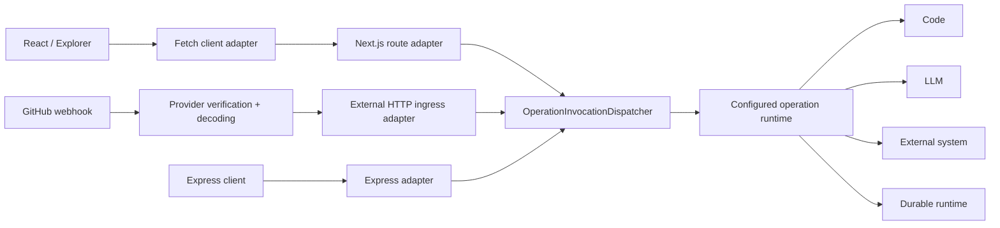

# 100f. Operation Invocation Capability

Status: done

Canonical ID: `ontahi://plans/100f-operation-invocation-capability`

Migrated from: `bookops://plans/100f-operation-invocation-capability`
Original path: `plans/done/100f-operation-invocation-capability.md`
Source commit: `cb9c038a`

Parent plan: [`100-ontahi-framework-extraction.md`](../done/100-ontahi-framework-extraction.md)

Advances goal: [`Ontahi Independently Usable`](ontahi://atlas/independently-usable)

Follows:

1. [`100e-ontahi-runtime-capabilities-and-repository-topology.md`](./100e-ontahi-runtime-capabilities-and-repository-topology.md)

Related plans:

1. [`75b-canonical-operation-invocation-results.md`](bookops://plans/75b-canonical-operation-invocation-results)
2. [`79-graph-native-schema-dsl.md`](bookops://plans/79-graph-native-schema-dsl)
3. [`78-first-class-authorization-and-relationship-policies.md`](bookops://plans/78-first-class-authorization-and-relationship-policies)

Related atlas shapes:

1. [`ontahi.model.operation-invocation`](ontahi://atlas/model/operation-invocation)
2. [`ontahi.model.domain-operation`](ontahi://atlas/model/domain-operation)
3. [`ontahi.runtime-capability-model`](ontahi://atlas/application-architecture-surface/runtime-capabilities)
4. [`ontahi.operation-contracts`](ontahi://atlas/operation-contracts)

## Summary

Make operation invocation a first-class Ontahi capability with one semantic message, one canonical dispatcher, and technology adapters for the ways that message enters a running application.

Client fetch calls, Next.js route handlers, Express handlers, external HTTP ingress, future queues, CLI commands, workflows, code handlers, LLM handlers, and external systems should not each invent operation lookup, validation, authority, execution, and result semantics.

The immediate slice proves the capability through the existing BookOps fetch path, the existing GitHub-style HTTP ingress path, a Next.js adapter, and a new Express adapter.

## Context

BookOps already has a de facto remote operation request:

```ts
{
  operationId: string;
  input: unknown;
  intent?: 'run' | 'checkPermission';
}
```

The production React provider uses the fetch bridge against a BookOps-owned Next.js route. A second BookOps Server Action bridge repeats operation lookup, ref normalization, Zod validation, permission checks, and execution. Core HTTP ingress can dispatch provider-decoded webhook payloads to operations, but it uses a separate low-level result path.

These are adapters around one missing semantic center: an operation invocation dispatcher.

The transport boundary must not own Zod. It accepts opaque input and delegates validation to the operation invocation capability. Today Ontahi operations use Zod-compatible input schemas; the Graph-Native Schema DSL may later supply the validator without changing HTTP, Express, React, webhook, or workflow adapters.

## Research / Evidence

Current pressure appears in:

1. `ontahi/packages/core/src/runtime/contracts.ts`,
2. `ontahi/packages/core/src/runtime/server/domain-operations.ts`,
3. `ontahi/packages/core/src/runtime/server/ingress.ts`,
4. `ontahi/packages/react/src/actions/fetch-operation-bridge-adapter.ts`,
5. `ontahi/packages/runtime-nextjs/src/actions/**`,
6. `web/src/app/api/data-graph/domain-operations/route.ts`,
7. `web/src/app/actions/domain-operations.ts`,
8. `web/src/providers/query-provider.tsx`.

The existing code already supplies most ingredients:

1. `OperationInvocationResult` distinguishes success, invalid input, rejection, expected failure, and unexpected error,
2. resolved domain operations expose stable IDs and input contracts,
3. the configured application facade runs bridged operations and permission checks,
4. React has Fetch and Next Action bridge adapters,
5. HTTP ingress providers authenticate and decode external requests before dispatch.

## Scope

1. Complete the canonical invocation result behavior required by this boundary.
2. Define transport-independent operation invocation and permission request/response contracts.
3. Add a core dispatcher that owns resolution, ref normalization, validation, permission checks, execution, and failure normalization.
4. Add a Next.js route adapter in `@ontahi/runtime-nextjs`.
5. Add `@ontahi/runtime-express` as the second server adapter.
6. Route core external HTTP ingress through the canonical dispatcher after provider authentication and decoding.
7. Update the React Fetch adapter to use the shared protocol instead of treating `next-safe-action` envelopes as the generic wire format.
8. Migrate BookOps to the Next.js adapter and remove its unused operation Server Action dispatcher.
9. Provide matching adapter contract suites for the Next.js and Express boundaries.

## Non-Goals

1. Do not finish the Graph-Native Schema DSL.
2. Do not replace every BookOps Server Action; `@ontahi/runtime-nextjs` remains useful for feature actions.
3. Do not redesign events as operations. Events remain facts; operation invocations remain requests or intentions.
4. Do not add queue, CLI, workflow, LLM, or external-system adapters in this slice.
5. Do not redesign identity and authority. Host middleware and configured operation requirements remain the authority composition points.
6. Do not expose raw HTTP request objects to operation implementations.
7. Do not create a standalone example application yet; the Express adapter contract tests are the portability proof for this slice.

## Proposed Form

### Semantic Vocabulary

1. **Operation**: a typed application intention with authority and result semantics.
2. **Operation invocation**: a message requesting that an operation be interpreted.
3. **Invocation dispatcher**: the semantic port that resolves, validates, authorizes, and executes the message.
4. **Transport envelope**: the serialized representation used by an adapter.
5. **Ingress adapter**: a technology boundary that maps Fetch, Next.js, Express, webhooks, queues, CLI, or workflows to the dispatcher.
6. **Operation handler**: the selected implementation, which may eventually be code, an LLM, an external system, or a durable runtime.



### Core Message

Use a discriminated semantic request rather than an optional transport flag:

```ts
type OperationInvocationRequest =
  | {
      kind: 'invoke';
      operationId: string;
      input: unknown;
    }
  | {
      kind: 'check-permission';
      operationId: string;
      input: unknown;
    };
```

The first implementation may accept the legacy optional `intent` at the HTTP compatibility edge, but core and new adapters should use the discriminated form.

### Dispatcher Boundary

The dispatcher accepts plain data and returns plain semantic results. It does not accept or return `Request`, `Response`, Express objects, Next.js objects, React hooks, or `next-safe-action` envelopes.

Malformed transport envelopes remain transport errors. Once an invocation request is valid, unknown operation, invalid operation input, permission rejection, expected failure, and unexpected execution errors use canonical semantic results.

### External HTTP Ingress

Provider adapters remain responsible for signatures, raw bodies, provider headers, delivery IDs, deduplication inputs, and provider event decoding. After that work, they map the decoded payload to an operation invocation and call the same dispatcher as client transports.

## Execution Slices

### A. Canonical Invocation Result

1. Normalize validation issues to `OperationValidationIssue[]`.
2. Keep one invocation result shape across direct execution, GraphOps, Fetch, Next.js, Express, and ingress dispatch.
3. Reserve transport errors for malformed envelopes and unavailable transports.

### B. Core Dispatcher

1. Define request, permission result, response, dispatcher, resolver, and executor contracts.
2. Implement resolution, entity-ref normalization, input validation, permission checks, and invocation execution in core.
3. Test success, unknown operation, invalid input, denied permission, expected failure, and unexpected error.

### C. Server Adapters

1. Add a Next.js route handler factory under `@ontahi/runtime-nextjs`.
2. Add `@ontahi/runtime-express` with an Express handler/router factory.
3. Run the same contract cases against both adapters.
4. Keep host auth, observability, and route mounting composable around the adapter.

### D. Ingress Convergence

1. Update `createGraphHttpIngressOperationDispatcher` to call the canonical dispatcher.
2. Preserve provider accepted/ignored/rejected semantics before operation invocation.
3. Preserve provider and delivery metadata for future invocation context work without making it raw operation input.

### E. BookOps And React Migration

1. Update the Fetch adapter to the shared protocol.
2. Mount the Next.js adapter from the BookOps route.
3. Keep BookOps observability around the mounted handler.
4. Remove the unused BookOps operation Server Action bridge and its duplicate tests.
5. Keep generic Next Action feature infrastructure and Storybook mocks where they remain useful.

## Verification

- [x] Canonical validation issues do not expose Zod-specific error structures.
- [x] Core dispatcher contract tests cover all invocation result kinds.
- [x] Next.js and Express adapters pass the same server adapter contract cases.
- [x] External HTTP ingress dispatches through the canonical operation dispatcher.
- [x] BookOps production Fetch invocation and permission checks use the shared protocol.
- [x] The duplicate BookOps operation Server Action dispatcher is removed.
- [x] Package builds, package tests, BookOps unit tests, Storybook tests, Workflow discovery, and Vercel production build pass.

## Decisions

1. Operation invocation is the capability; client-server bridge is one adapter family.
2. Operations are semantic messages, not transport-specific function calls.
3. Events and operation invocations remain distinct even when both enter through HTTP.
4. Zod is an implementation detail behind invocation validation, not a transport dependency.
5. The protocol lives with core operation semantics; Next.js and Express own only technology adaptation.
6. Do not create a generic `@ontahi/runtime-http` package until the Next.js and Express adapters reveal meaningful shared implementation beyond the core protocol.
7. Keep this semantic slice separate from the already committed mechanical package relocation.
8. Unknown operations remain canonical rejections carried by HTTP 200 protocol responses; transport status codes describe the envelope and adapter availability, not the domain outcome.

## Open Questions

1. Should invocation context gain correlation, actor, source, and idempotency metadata in a bounded follow-up?
2. Should permission checks remain a request kind or become a reflected operation of the authority model later?

## Closure / Evolution

Closed on 2026-07-19. BookOps Fetch invocation, Next.js, Express, and external HTTP ingress now share one canonical dispatcher and protocol while schema validation remains replaceable behind the operation runtime.

The slice also removed the unused BookOps operation Server Action bridge, normalized public validation issues, and proved the browser/server package boundaries through full unit, Storybook, workspace, workflow, and Vercel builds.

Likely follow-ups:

1. queue and CLI ingress adapters,
2. invocation context and distributed tracing metadata,
3. idempotency and delivery semantics,
4. handler selection across code, LLM, external-system, and durable implementations,
5. protocol versioning when a second independently deployed Ontahi application requires it.
