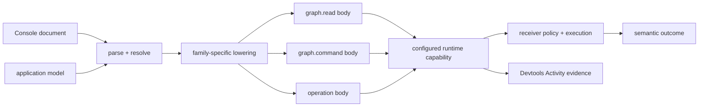

# 150. Ontahí Devtools Semantic Console

Status: next

Canonical ID: `ontahi://plans/150-ontahi-devtools-semantic-console`

Related plans:

1. [100f. Operation Invocation Capability](../done/100f-operation-invocation-capability.md)
2. [118. Ontahí Selection Language Editor](../done/118-ontahi-selection-language-editor.md)
3. [128. Ontahí Data Graph Execution Bridge](../current/128-ontahi-data-graph-execution-bridge.md)
4. [132. Durable Invocation Identity And Idempotency](./132-durable-invocation-identity-and-idempotency.md)
5. [145. Ordered Relations And Sequence Commands](../done/145-ordered-relations-and-sequence-commands.md)
6. [146. Ontahí Runtime Protocol](../done/146-ontahi-runtime-protocol.md)
7. [147. Application-Bound Headless Graph Reads](../done/147-application-bound-headless-graph-reads.md)
8. [148. Ontahí Devtools Runtime Inspection](../current/148-ontahi-devtools-runtime-inspection.md)

Related Atlas shapes:

1. [`ontahi.source-code-organization.devtools`](ontahi://atlas/source-code-organization/devtools)
2. [`ontahi.developer-experience`](ontahi://atlas/developer-experience)
3. [`ontahi.semantic-interaction-language`](ontahi://atlas/semantic-interaction-language)
4. [`ontahi.runtime-protocol`](ontahi://atlas/application-architecture-surface/runtime-protocol)

## Summary

Add a **Console** panel to Ontahí Devtools where a developer can author and execute semantic Graph
Reads, Graph Commands, and Operation invocations against the application currently connected to the
browser:

```text
TodoItem
  .where(completed = false)
  .view(TodoItemSummary)
  .limit(20)
  .many()

TodoList("inbox").items.move(
  TodoItem("todo-3"),
  before: TodoItem("todo-1"),
)

TodoList.createItem({
  list: TodoList("inbox"),
  title: "Ship the semantic console",
})
```

The syntax above is representative rather than frozen, but one constraint is decided: source does
not begin with `read`, `command`, or `invoke` keywords. The resolver infers the semantic family from
the reflected root symbol, selected members, arguments, and terminal expression. The durable product
shape is a semantic, reflection-assisted console that lowers valid documents to existing canonical
request bodies and executes them through the application's configured runtime. It is not JavaScript
`eval`, an arbitrary HTTP client, a server shell, or a privileged policy bypass.

The first visual host is a new Devtools panel. Its parser, resolver, lowering, and execution
coordination remain headless so a future terminal CLI can use the same documents and outcomes
without importing React or reconstructing Ontahí semantics.

## Context

Plan 148 gives Devtools an Activity stream for observing semantic runtime work after application
code initiates it. Explorer can inspect reflected structure and invoke one reflected Operation from
a generated form. The Selection language can author a contextual predicate and lower it to the
canonical Selection AST. The Runtime Protocol can already carry Operation, Graph Read, and Graph
Command bodies over HTTP, WebSocket, or process-local transports.

The missing loop is intentional interaction. A developer who wants to answer “does this View return
the expected TodoItems?”, “what does this ordered move do?”, or “how does this Operation reject this
input?” must currently write temporary application code, find an Explorer-specific form, or assemble
a protocol request by hand. None is equivalent to a small Ontahí-native CLI embedded beside the
runtime evidence.

Historical BookOps GraphOps work is useful evidence: reflected operation forms and entity data
browsing make domain capabilities discoverable, but they are task-specific panels. A Console should
compose those capabilities through one repeatable authoring surface without collapsing Explorer's
topology/catalog role into Devtools or making a React form the semantic source of truth.

## Product Boundary

The Console has four responsibilities:

1. **Discover:** offer Entity, View, Field, Relationship, Command, and Operation assistance from an
   application model supplied by the host.
2. **Author:** preserve source text, cursor position, recoverable syntax, diagnostics, and explicit
   user intent.
3. **Execute:** lower one valid expression to one existing family request and send it through the
   configured runtime capability.
4. **Explain:** show the semantic result or rejection, duration, selected transport, and correlated
   Activity evidence without reducing everything to raw JSON.

It does not own:

1. Entity, Query, Command, Operation, policy, or Runtime Protocol semantics;
2. authentication or authorization decisions;
3. server-side reflection policy;
4. transport routing state;
5. Explorer's application-topology and catalog experience;
6. arbitrary JavaScript, filesystem, process, database, or network execution.

## Proposed Form

### One Console, Three Existing Families



The Console is not a new Runtime Protocol family. Semantic resolution determines whether an
expression denotes a Query terminal, a Graph Command, or an Operation invocation, and its lowerer
produces that family's canonical portable body. Family names are execution metadata shown by the UI,
not leading source keywords. The ordinary dispatcher, parser, policy, authority context, and
executor remain authoritative on the receiver. Transport envelopes and receiver context are not
editable source language.

The first language should support one expression per execution. Multi-expression scripts,
transactions, pipes, variables, loops, and background jobs require separate semantics and are not
implied by a visual terminal metaphor.

### Authoring Model

The editor should behave like a semantic expression entry rather than a raw JSON textarea:

1. completions come from grammar plus reflected application facts;
2. hover or inline help explains the selected Entity, View, Relationship, Command, or Operation;
3. syntax and semantic diagnostics block execution before a request is sent;
4. execution failures, policy rejections, and transport failures remain separate from editor
   diagnostics;
5. `Mod-Enter` executes the current valid expression;
6. formatting preserves or deliberately rewrites one text document rather than mutating hidden form
   state;
7. an optional generated/portable-body view explains the exact family body but is not the primary
   editor in the first slice.

The language capability must not grow one universal “Console AST” that duplicates Query, Selection,
Command, Operation, or protocol types. A small recoverable expression syntax owns member access,
calls, arguments, incomplete input, and source ranges. Semantic resolution binds those nodes to
reflected Ontahí symbols and thereby discovers the family; valid meaning then lowers into the
existing family-owned representations.

### Graph Reads

The Read form should cover a useful vertical slice before attempting a complete textual Query DSL:

1. Entity and cardinality (`many`, `first`, `one`, `count`, or `exists`);
2. an optional named View and its parameters;
3. an optional `where` expression using the existing Selection language;
4. explicit ordering, pagination, and limit only where the canonical Graph Read model already has
   truthful portable semantics;
5. an explainable result that preserves Entity identity and View shape.

The first walking skeleton should be a self-contained textual expression. The UI may later project
reflected structural controls into that source, as the Selection editor does for finite values, but
it must not keep a hidden family selector or other execution meaning outside the document. Every
projection must produce the same canonical Graph Read body and remain usable through a headless
adapter.

### Graph Commands

The Command form should discover and author the Commands the reflected application and runtime can
actually support:

1. exact Entity create, update, and delete where those Commands are public and portable;
2. direct Relationship attach, detach, replace, and clear;
3. many-to-many link and unlink;
4. ordered Relationship placement and move using `before`, `after`, or `at`;
5. optimistic preconditions when the underlying Command declares them.

Command assistance should use canonical Entity Refs and reflected Relationship facts. The receiver
must still parse the portable Command body and enforce policy. A missing editor affordance is not a
denial, and a visible completion is not authorization.

### Operation Invocation

The Invoke form should select a reflected executable Operation, assist input construction from its
contract, and submit the ordinary versioned Operation request. Permission preflight may improve the
UI but never substitutes for invocation-time authorization. The result view must preserve the
canonical distinctions among success, invalid input, policy rejection, expected failure, unexpected
failure, and transport/protocol failure.

Durable Operations should return and link to their existing Task/run identity and progress evidence.
The Console does not create a parallel durable lifecycle or wait language in the first slice.

### Results And History

The visual panel should contain:

1. an expression editor with assistance and a clear execution action;
2. a result region with semantic, portable-body, and raw-envelope progressive disclosure;
3. family, status, duration, selected transport, and correlation metadata;
4. a direct path to the matching Activity detail when diagnostics are enabled;
5. bounded, session-local source history;
6. keyboard navigation, accessible status announcements, and a usable narrow layout.

Selecting history restores source only. It never executes automatically. Reads may be executed again
through the ordinary explicit action. A previous Command or Operation is historical source, not an
idempotent replay token; executing it again is a new user-initiated effect and must use the configured
confirmation policy. Automatic retry, replay after ambiguous failure, and one-click mutation replay
remain outside this plan until invocation identity and idempotency semantics are truthful.

## Headless Ownership And Integration

The intended first boundary reuses existing packages instead of creating a Console-only semantic
stack:

1. `@ontahi/language` owns editor-neutral expression parsing, recovery, diagnostics, reflection-shaped
   assistance, formatting, and family-specific lowering. Existing Selection parsing remains a
   nested semantic service rather than copied grammar.
2. `@ontahi/language-codemirror` projects that service into the browser editor. It owns CodeMirror
   integration, not runtime execution.
3. `@ontahi/devtools` owns a headless Console session model: source/history lifecycle, execution
   state, outcome classification, cancellation/abort wiring, and correlation with diagnostics.
4. `@ontahi/devtools/react` owns the panel, layout, controls, result rendering, and accessibility.
5. The host supplies a narrow application model plus executable Read, Command, and Operation ports
   backed by its ordinary clients and configured Runtime Transport. Devtools does not import a
   server runtime, storage provider, or Explorer React contract.

These package assignments are the starting hypothesis. The first execution slice may extract a
smaller shared headless package if a concrete terminal CLI proves that `@ontahi/devtools` is the
wrong dependency direction; the plan should not create that package preemptively.

The browser panel uses the same authenticated host session and the same effective transport routing
as application code. A future CLI may bind the same execution ports to Fetch, WebSocket, or
process-local transport and choose its own authentication adapter. CLI formatting, prompts, config
files, shell completion, and credential storage are adapter work, not part of the semantic engine.

## Application Model And Reflection

The Console needs more authoring context than the current contextual Selection editor, but it must
not depend on Explorer UI descriptors or assume all intrinsic schema is executable under the active
authority.

Define a narrow, framework-owned Console application model that can describe:

1. Entities, identities, Fields, scalar/value types, and named Views;
2. Relationships, cardinality, ordering, and available canonical Command forms;
3. Operations, input/output contracts, destructive/effect classification where declared, and
   Durable metadata;
4. family/runtime capability availability;
5. optional documentation and deprecation facts.

The host may initially project this from generated client metadata and static reflection. Runtime
Data Reflection can later narrow or enrich it with authority-aware capability and reference-value
lookup. The model drives assistance only. The receiver remains the enforcement boundary even when
the model is stale, broader than current authority, or unavailable.

## Safety And Policy

1. The Console is mounted only when the host explicitly includes Devtools and enables this panel.
2. Production inclusion and mutable execution controls require an explicit host choice.
3. Portable requests never contain client-authored authority, trusted actor, role, or receiver
   context.
4. Runtime handlers apply the same authentication, policy, validation, limits, telemetry, and
   transport rules as ordinary application calls.
5. Statement and result retention is bounded and in-memory by default. Redaction occurs before
   diagnostic or history storage.
6. Mutation and Operation submission is an explicit action with a host-configurable confirmation
   policy; destructive declarations should inform the default UI but are not security enforcement.
7. No automatic retry occurs after an ambiguous transmission or execution outcome.
8. There is no arbitrary JavaScript evaluation, dynamic module import, raw SQL, shell command,
   unrestricted URL fetch, header/cookie editor, or raw Runtime Protocol envelope sender.
9. Unsupported families, unavailable handlers, stale reflection, and policy rejection fail visibly
   rather than falling back through another path.

## Scope

1. Specify the one-expression semantic document and reflection-driven family-resolution boundary.
2. Provide reflection-assisted authoring and lowering for a useful Graph Read, Graph Command, and
   Operation vertical slice.
3. Add a headless Console session and execution port contract.
4. Add the Devtools Console panel and integrate it with effective Runtime Transport routing.
5. Correlate Console outcomes with Activity evidence when the diagnostic decorator is present.
6. Add bounded, redacted, session-local source history.
7. Prove the three families in the Todo example, including one ordered Relationship move.
8. Preserve a DOM-free boundary that a terminal CLI can consume later.

## Non-Goals

1. No JavaScript REPL, Node/browser console replacement, shell, raw SQL runner, or arbitrary HTTP
   client.
2. No new Runtime Protocol family, envelope, Graph Read model, Command model, Operation model, or
   authorization path.
3. No general-purpose scripting language, variables, loops, pipes, transactions, or multi-expression
   atomicity.
4. No automatic mutation retry, background execution, replay, batch runner, or saved executable
   macro.
5. No server-side admin bypass, service-role selector, credential editor, or policy impersonation.
6. No requirement to complete all Query syntax, relation predicates, dynamic reflection, or an LSP
   before the first walking skeleton.
7. No replacement for Explorer's application catalog/topology, generated typed application code, or
   normal product UI.
8. No standalone CLI binary in the first visual slice; only its reusable headless semantic and
   execution boundary.
9. No persistent or synchronized source history in the first slice.

## Execution Slices

### A. Contract And Syntax Gate

1. Inventory the canonical Read, Command, and Operation bodies plus current reflected metadata.
2. Write representative keyword-free Console documents for Todo and one second test application.
3. Define the smallest self-contained expression grammar and prove that reflection can resolve its
   root/member chain to one semantic family without a leading discriminator.
4. Define diagnostics, lowering outcomes, execution outcomes, and source-history contracts without
   depending on React or CodeMirror.
5. Record unsupported syntax and runtime capabilities explicitly rather than silently accepting
   future-looking forms.

### B. Read Walking Skeleton

1. Parse and resolve one Query expression against the supplied application model.
2. Reuse the existing Selection language for `where`.
3. Lower Entity, cardinality, View/params, Selection, ordering, pagination, and limit only where
   supported by the canonical Graph Read body.
4. Execute through the host's ordinary Graph Read client and configured Runtime Transport.
5. Render semantic results and correlated Activity evidence in a minimal Console panel.

### C. Operation Invocation

1. Add Operation discovery, contract-driven input assistance, and validation diagnostics.
2. Lower to the canonical versioned Operation request.
3. Preserve permission preflight and invocation-time authorization as distinct outcomes.
4. Render every canonical invocation result and link Durable acceptance to Activity/run progress.
5. Require explicit confirmation according to the configured effect/destructive policy.

### D. Graph Commands

1. Add exact Entity mutation and Relationship Command discovery from the application model.
2. Lower direct, many-to-many, and ordered forms to the existing versioned Command body.
3. Preserve typed preconditions and Command results.
4. Prove attach/detach plus ordered `move before|after|at` in Todo.
5. Treat every submission as a new effect and never retry through transport ambiguity.

### E. Console Experience

1. Complete grammar-aware completion, hover/help, formatting, and error positioning.
2. Add semantic/body/envelope result disclosure and request metadata.
3. Add bounded, redacted source history with restore-only selection.
4. Add keyboard, screen-reader, focus, resizing, and narrow-layout behavior.
5. Make unavailable application model, handler, family, transport, and diagnostics capabilities
   explicit in empty/error states.

### F. CLI Projection Follow-Up

1. Prove the headless language and Console session APIs in a small non-React harness.
2. Decide whether a standalone CLI belongs in `@ontahi/devtools`, a new package, or a host tool
   after real authentication and configuration requirements are known.
3. Specify terminal input/output, config discovery, transport selection, credential handling, and
   non-interactive exit codes in a separate implementation plan.

## Implementation Checkpoint

Checkpoint 2026-09-08, Graph Read walking skeleton:

1. The existing Lezer grammar now exposes independent `SelectionDocument` and `ConsoleDocument`
   top rules while sharing the exact `OrExpression` Selection productions.
2. `@ontahi/language` parses and resolves the first self-contained keyword-free expressions,
   `Entity.where(Selection).many()`, nullable `Entity.where(Selection).first()`, and exact-cardinality
   `Entity.where(Selection).one()`, plus their unfiltered `Entity.many()`, `Entity.first()`, and
   `Entity.one()` forms, and lowers them to canonical `GraphReadRequestV1` bodies. An omitted
   `.where(...)` resolves to the canonical `all` Selection. Filtered and unfiltered `.count()`
   terminals use the canonical count mode without row cardinality or limit.
3. Many reads accept `.limit(nonNegativeInteger)` before their terminal and lower that source value
   to the canonical request limit; combinations with `first()`, `one()`, `count()`, or `exists()` are rejected
   as meaningless.
4. Core Entity definitions can be projected into the existing narrow Selection reflection input;
   Entity and nested Field completions remain headless.
5. `@ontahi/language-codemirror` exposes the Console parser, completion, lint, highlighting, and
   `Mod-Enter` execution extensions without copying Selection semantics. Its nested Selection also
   reuses the source-backed finite-value projections for Boolean and enum literals.
6. `@ontahi/devtools/react` exposes an opt-in Console panel that submits the lowered Read through
   the configured Runtime Transport, renders the result through shared Visual or JSON projections,
   preserves structured exact-one cardinality feedback, and produces ordinary Activity evidence.
7. Todo supplies its generated Entity schemas and starts with
   `TodoItem.where(completed = false).many()` as the browser proof.
8. `.orderBy(field[, asc|desc])` reuses canonical Graph Read ordering, with one reflected scalar
   Field and ascending as the default. The grammar orders `where`, `orderBy`, `limit`, then the
   terminal. Ordering is supported for `many`, `first`, and `one`, not `count` or `exists`.
9. Visual many-result headers and source are projections of that same Query. Header actions cycle
   ascending/descending/none, apply source-range edits in one undoable CodeMirror transaction, and
   explicitly execute through Runtime Transport. No client-side row sorting or hidden sort state
   is introduced. Text editing and Undo do not run automatically.
10. Results retain the successful execution's source and canonical request. Arrows describe that
    snapshot; draft changes, pending reads, and failures do not rewrite the old result. Invalid,
    other-Entity, non-many, and in-flight drafts disable table actions. Valid same-Entity drafts
    retain their filters and limits when a header action submits them.
11. The read-ordering slice is covered by headless lowering/source-edit tests, CodeMirror finite
    projection/deletion tests, and Devtools integration against the real in-memory read dispatcher
    (ordering before limit, policy rejection, Undo, pending edits, transport failure, empty rows).
12. Ordering-only policy rejections now preserve `access_denied` and report the requested Entity
    and Field with optional structured `ordering_not_allowed` details. Console displays the
    receiver's precise message while retaining the successful result snapshot. Unknown policies
    and other denials remain generic; no permissions are broadened.
13. Console requests opt-in ordering capabilities with each Graph Read. The receiver derives root
    Field names from its ordinary policy checks, including derived dependencies, and emits them
    only with successful results. Headers intersect these names with intrinsic scalar types;
    denied headers explain the policy restriction without editing or sending requests. Missing
    or malformed metadata, a replaced transport, or a policy denial require a fresh successful
    Run before sorting. Capabilities are advisory snapshots; every read remains authorized anew.
    `orderBy(...)` autocomplete consumes the same Entity/transport-bound snapshot, excluding denied
    Fields and offering none when capabilities are unavailable. An optional headless completion
    resolver narrows assistance without restricting manual authoring or changing query semantics;
    CodeMirror reconfiguration drops stale suggestions without changing source or history.
14. Visual many-result limits are editable with Apply/Enter. The headless `editConsoleLimit` helper
    inserts or replaces only the limit's source range, preserving filters, ordering and trivia in
    one undoable transaction. Textual changes reflect after Run; pending/failing requests retain
    the executed limit and results. Invalid/other-Entity/non-many drafts and replaced
    transports disable the control. Zero is supported; server maximum policy remains unchanged.
    Pagination and total counts are not inferred from this control.
15. Result chrome is compacted into one toolbar with last successful round-trip duration, limit
    and Visual/JSON. The duplicate query disclosure, success message and row/limit summary are
    removed. Apply appears only for a changed numeric draft; stale/pending notices are inline and
    errors remain actionable. Timing belongs to the successful snapshot, not a pending/failed read.
16. Filtered and unfiltered `exists()` lower to nullable `get` with `limit: 1`, independent of the
    Console display limit, matching the application Graph Read intent. The Console projects only
    successful record/null results to Boolean in Visual/JSON; policy, transport and malformed
    response failures remain errors. Projection is tied to the submitted source, not an in-flight
    draft. Completion, highlighting and rich Selection values reuse the shared language. No
    protocol mode, permission, ordering, or display-limit control is added for existence reads.
17. Multiple ordering Fields, named Views, other Query terminals/members,
    source history, Commands, Operations, full reflection
    delivery, and the terminal CLI remain later slices of this plan.
18. PR review hardening preserves the eight Console member words as contextual identifiers in
    Selection Fields and Entity names, covers implicit get-cardinality error mapping, and adds
    execution-shortcut/unresolved-projection coverage without lowering coverage thresholds.
    Analysis diagnostics and result rendering are split by responsibility; result controls and
    status use native accessible elements without adding UI chrome.

## Acceptance Checklist

- [ ] A developer can author and execute at least one Graph Read, Graph Command, and Operation
      invocation from the Devtools Console.
- [ ] The Todo proof includes a filtered View-backed Read and an ordered Relationship move.
- [ ] Every valid expression lowers to an existing canonical family body; the Console introduces no
      protocol family or authority field.
- [ ] Read, Command, and Operation expressions resolve unambiguously without leading `read`,
      `command`, or `invoke` keywords or a hidden UI family selector.
- [ ] Syntax/semantic diagnostics are distinguishable from policy, application, protocol, and
      transport outcomes.
- [ ] Reflection drives assistance but does not determine authorization.
- [ ] The receiver applies the same parsing, validation, policy, limits, and authority as ordinary
      application traffic.
- [ ] Console work uses the application's effective configurable Runtime Transport and appears as
      ordinary correlated Activity evidence.
- [ ] Switching transport routing affects newly submitted Console work without migrating or
      replaying active work.
- [ ] Unknown or unsupported families and unavailable handlers fail visibly.
- [ ] A previous Command or Operation never executes merely because history is opened, selected, or
      restored.
- [ ] Commands and Operations require explicit submission and follow the configured confirmation
      policy; ambiguous failures are never retried automatically.
- [ ] History and diagnostics are bounded, session-local by default, and redact before retention.
- [ ] The Console cannot evaluate arbitrary JavaScript, run shell/SQL, fetch arbitrary URLs, edit
      credentials, or submit raw authority/context.
- [ ] Parser, resolver, lowering, and Console session tests run without DOM or React.
- [ ] React tests cover execution states, result kinds, history safety, keyboard behavior, and
      capability-unavailable states.
- [ ] Browser integration tests prove the Read, Invoke, and ordered Command flows against Todo.
- [ ] The Devtools production and opt-in mounting rules remain explicit and documented.

## Verification

1. Golden syntax/diagnostic cases for complete, incomplete, invalid, and unsupported documents.
2. Lowering conformance fixtures comparing Console output with canonical family parsers.
3. Headless Console session tests for abort, concurrent submission prevention, outcome
   classification, redaction, retention bounds, and history restore.
4. Runtime adapter tests proving active routing, receiver-derived authority, rejection behavior,
   no automatic fallback, and diagnostic correlation.
5. React component tests for completion, execution, confirmation, result disclosure, history,
   focus, accessibility, and narrow layout.
6. Todo browser tests over both HTTP and supported WebSocket routing profiles.
7. Package typecheck, lint, formatting, tests, builds, Changeset status, and clean-room artifact
   verification for every changed public package.

## Decisions

1. The product is an Ontahí semantic Console, not a JavaScript or protocol-envelope console.
2. `read`, `command`, and `invoke` are not source keywords. Reflection-driven semantic resolution
   infers the existing family from the expression root, members, and terminal meaning.
3. Source text is authoring truth. Canonical Core and Runtime Protocol values are execution truth.
4. The language service is headless; CodeMirror and the Devtools panel are adapters.
5. The browser panel ships first, while the boundary remains reusable by a later terminal CLI.
6. Devtools consumes a narrow framework application model and executable ports, never Explorer UI
   contracts or server storage/runtime internals.
7. Reflection supplies intrinsic assistance and capability hints; only receiver policy authorizes
   execution.
8. Activity observes Console traffic exactly as ordinary application traffic; Console does not
   create a second diagnostic channel.
9. History restores source and never implies replay. A repeated effect is a new explicit invocation.
10. Multi-expression scripts, transactions, and persistent macros wait for their own semantic model.

## Open Questions

1. Which Query member chain best matches Ontahí's existing typed API while remaining readable and
   recoverable as an incomplete Console expression?
2. Which framework-owned reflection projection supplies the first complete Console application
   model: generated client metadata, static application reflection, Runtime Data Reflection, or a
   deliberate composition?
3. How should a Read select nested projection when a named View is unavailable without prematurely
   designing a complete Query language?
4. Should write confirmation be always-on in Devtools, driven by reflected effect/destructive
   metadata, or supplied as an explicit host policy?
5. Which correlation receipt should ordinary family clients expose so Console can deep-link to
   Activity without coupling execution to the diagnostic store?
6. Which mutation replay affordances, if any, become safe only after Plan 132 establishes invocation
   identity and enforceable idempotency?
7. Does a real terminal proof justify a separate headless Console package, or are
   `@ontahi/language` plus `@ontahi/devtools` the correct reusable boundary?
8. How should a standalone CLI acquire host configuration and credentials without turning the
   Console document into a deployment-specific transport script?
