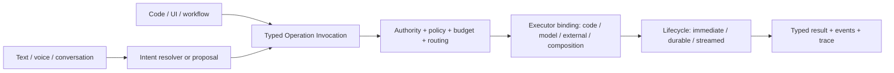

# 125. Ontahi AI Operations

Status: research

Canonical ID: `ontahi://plans/125-ontahi-ai-operations`

Migrated from: `bookops://plans/125-ontahi-ai-operations`
Original path: `plans/research/125-ontahi-ai-operations.md`
Source commit: `cb9c038a`

Shapes: [`Model-Backed Operation Execution`](ontahi://atlas/model/model-backed-operation-execution)

Related plans:

1. [`99. Semantic Editorial Workflows`](bookops://plans/99-semantic-editorial-workflows)
2. [`100f. Operation Invocation Capability`](../done/100f-operation-invocation-capability.md)
3. [`70. First-Class Workflow Tier`](bookops://plans/70-first-class-workflow-tier-in-architecture)
4. [`90. Event-Driven Architecture Runtime`](bookops://plans/90-event-driven-architecture-runtime)
5. [`120. Ontahi Environment Resources And Semantic Bindings`](../next/120-ontahi-environment-resources-and-semantic-bindings.md)

## Summary

Shape model-backed execution as a native implementation mode for Ontahi operations. One operation
contract and one canonical invocation should remain stable while runtime composition selects code,
a model, an external system, or a composition as its executor.

`AI Operations` is the visible direction. `Model-Backed Operation Execution` remains the precise
name for its runtime mechanism.

The research must also separate two uses of models that the Semantic Edition direction brings
together: a model may resolve fuzzy human intent into reviewable typed invocations, or it may
execute an already selected typed operation. Both use the Ontahi operation language, but they have
different authority, validation, review, and observability requirements.

## Context

Ontahi already has the semantic center this direction needs:

1. Domain Operations carry identity, typed input and output, authority, contracts, and results.
2. Operation Invocation is a transport-independent message interpreted by one dispatcher.
3. Durable Operations expose task identity, progress, failure, and eventual output.
4. Runtime Capabilities can supply host resources without leaking technology into the domain.
5. Semantic Editorial proposes that an LLM return reviewable operation invocations instead of an
   opaque source rewrite.

The missing shape is executor selection and model-specific policy. Without it, each AI feature
creates an application-local provider call, context builder, tool loop, output parser, trace, and
approval path. That treats AI as an overlay and loses the semantic operation contract Ontahi
already knows.

The development curve is part of the promise. A team may model an operation and make it useful
through a soft model-backed implementation before its behavior is fully understood. Stable
instructions, evaluations, hybrid paths, and eventually deterministic code can petrify the parts
that become repetitive, expensive, or safety-critical without changing the operation contract or
its callers. Fuzzy judgement may remain model-backed where that is still the honest behavior.

## Research / Evidence

The AI-native Ontahi flyer in
`ai-build-log-lab/mockups/ontahi-ai-native-flyer.html` supplies the strongest existing design
artifact. It establishes these useful claims:

1. an operation is a semantic message rather than a local function call;
2. transport is incidental to invocation;
3. the runtime owns authority, policy, routing, budget, audit, and executor choice;
4. an operation may begin as a soft intention, become prompt-backed, and later harden into code;
5. text and voice are fuzzy ingress that resolve to a typed operation;
6. graph context should be limited to declared sources and leave a trace;
7. a model executor is one native operation implementation beside code and external systems.

Plan 99 contributes the product-side Semantic Edition loop: an agent proposes registered operation
invocations that a human can preview, accept, and apply. Plan 100f already defines the canonical
dispatcher and explicitly reserves handler selection across code, LLM, external-system, and
durable implementations as follow-up work.

The flyer presents `soft -> prompt-backed -> coded -> durable` as one path. Research should refine
that into independent axes so the model remains honest:

| Axis                  | Candidate values                                            |
| --------------------- | ----------------------------------------------------------- |
| Semantic contract     | operation identity, typed input/output, authority, failures |
| Ingress               | direct typed invocation or fuzzy intent resolution          |
| Implementation mode   | code, model, external system, composition                   |
| Execution lifecycle   | immediate, durable, streamed                                |
| Maturity and evidence | soft, prompt-backed, evaluated, hardened                    |

A model-backed operation may be durable; a coded operation may be immediate or durable. Durability
describes how execution lives through time, not how mature its implementation is.

## Scope

1. Define an executor-binding model that preserves one public operation contract.
2. Separate fuzzy intent resolution, proposal, invocation, and execution.
3. Define model-executor metadata for allowed sources, tools, output validation, budget, trace,
   evaluation, and human approval.
4. Define how graph Refs and Selections assemble authorized context without materializing the whole
   graph or bypassing authority.
5. Define private agent workspace and memory as scoped runtime resources rather than Entity state.
6. Define how model execution composes with immediate, durable, and future streamed lifecycles.
7. Define audit and replay semantics without pretending a nondeterministic model call is
   deterministically replayable.
8. Recommend one narrow prototype that exercises the riskiest boundary.

## Non-Goals

1. Do not build a generic autonomous-agent platform in this research plan.
2. Do not freeze the flyer's pseudo-API as a public builder surface.
3. Do not make natural-language intent equivalent to an authorized invocation.
4. Do not make model output authoritative by default.
5. Do not store prompts, scratch files, or model memory as domain Entities merely because they are
   stateful.
6. Do not require every soft operation to mature into deterministic code.
7. Do not design Living Entities or dynamic schema activation here.

## Proposed Form



An illustrative declaration may eventually read like this, but the research owns the concepts,
not this spelling:

```ts
Concept.operation('explain', {
  input: { subject: Concept.ref },
  output: Explanation,
  implementation: model({
    sources: [Book, Atlas, ReaderNotes],
    trace: 'cite-nodes',
    budget: { tokens: 4_000 },
  }),
});
```

The same caller should remain valid if composition later replaces that implementation with code or
wraps it in a durable lifecycle:

```ts
const explanation = await Concept.explain({ subject: Concept.refById('rose') });
```

### Executor contract

The smallest useful model executor should receive:

1. the resolved operation and normalized typed input;
2. authority and policy context;
3. explicitly bound graph sources and tools;
4. output schema and canonical failure semantics;
5. budget, cancellation, and lifecycle context;
6. trace, provenance, and evaluation sinks;
7. optional scoped working resources.

It should return the ordinary canonical operation result. Provider messages, tool-call envelopes,
and token accounting remain adapter evidence unless promoted into reflected Ontahi contracts.

### Semantic Edition relationship

Semantic Edition first uses a model before authoritative execution:

```text
human instruction -> proposed invocations -> preview -> human acceptance -> execution
```

Model-backed execution uses a model inside the chosen operation:

```text
typed invocation -> authority and policy -> model executor -> typed result
```

One product flow may use both, but acceptance of a proposal must not silently grant the model
broader tool, graph, or persistence authority inside the executed operation.

## Execution Slices

### Slice 1: Contract Inventory

- [ ] Inventory current dispatcher, operation implementation, durable lifecycle, capability, and
      telemetry boundaries.
- [ ] Identify which model-executor needs already exist as runtime resources or concerns.
- [ ] Separate enduring semantic metadata from provider-specific configuration.

### Slice 2: Invocation And Executor Model

- [ ] Specify intent resolution, proposal, invocation, executor binding, and lifecycle as distinct
      stages.
- [ ] Decide whether executor binding occurs at declaration, application composition, or runtime
      routing—and whether several bindings can coexist safely.
- [ ] Specify typed output validation and canonical failures for model execution.
- [ ] Specify context-source, tool-authority, budget, trace, and approval boundaries.

### Slice 3: Narrow Prototype

- [ ] Implement one non-authoritative, read-only operation with a model executor.
- [ ] Invoke it through the same public surface and dispatcher as a code-backed operation.
- [ ] Prove a code-backed replacement without changing the operation's public identity or input.
- [ ] Exercise one durable variant if immediate execution cannot answer the lifecycle questions.

### Slice 4: Recommendation

- [ ] Record the package and composition boundaries.
- [ ] Record the minimal reflection surface and what must remain host-private.
- [ ] Extract implementation work into an actionable plan only after the prototype resolves the
      executor-binding and authority questions.

## Verification

- [ ] One operation preserves its public invocation across code-backed and model-backed executors.
- [ ] Model output is validated against the operation output contract.
- [ ] Undeclared sources and tools are unavailable to the executor.
- [ ] Trace evidence identifies selected sources, tool use, provider/model, cost, and outcome
      without leaking secrets or private content.
- [ ] Immediate and durable lifecycle choices do not alter the operation's semantic identity.
- [ ] Fuzzy intent cannot bypass canonical validation, authority, or proposal review.
- [ ] Private workspace state has an explicit owner, scope, retention policy, and cleanup path.
- [ ] The resulting contract can be explained without requiring one model vendor or agent SDK.

## Decisions

1. Model-backed execution is an implementation mode of Domain Operation, not a parallel `AiAction`
   abstraction.
2. Operation Invocation remains the typed semantic message shared by code, UI, agents, transports,
   and workflows.
3. Intent resolution is upstream from invocation; it is not authorization.
4. Implementation mode, execution lifecycle, and maturity are independent axes.
5. Authoritative graph state remains in Entities; agent working state is a scoped runtime resource.
6. The first prototype must be read-only and non-authoritative unless a narrower plan explicitly
   supplies approval and persistence semantics.

## Open Questions

1. Can one operation expose several executor bindings for rollout, fallback, cost, or evaluation?
2. Which executor metadata is semantic enough to reflect, and which remains host/provider policy?
3. How are prompts versioned without making prose the operation's only source of meaning?
4. Should evaluation assertions become operation contracts, policy, or external evidence?
5. How should retries distinguish transport failure from a new nondeterministic model attempt?
6. What trace can be replayed, and what can only be audited or re-executed approximately?
7. When does private agent state become a durable application fact that deserves an Entity?
8. How should human approval compose with a durable run that pauses and later resumes?

## Closure / Evolution

This research is complete when it produces an evidence-backed executor contract, a narrow
prototype, and a decision about package and reflection boundaries. Semantic Editorial remains the
BookOps product workstream; this plan owns the reusable Ontahi execution model it can consume.
