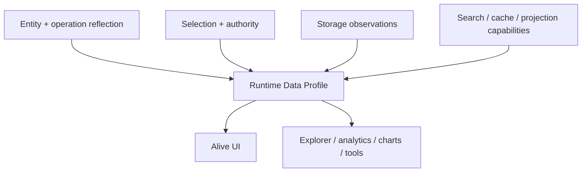

# 126. Ontahi Runtime Data Reflection

Status: research

Canonical ID: `ontahi://plans/126-ontahi-runtime-data-reflection`

Migrated from: `bookops://plans/126-ontahi-runtime-data-reflection`
Original path: `plans/research/126-ontahi-runtime-data-reflection.md`
Source commit: `cb9c038a`

Shapes: [`Runtime Data Reflection`](ontahi://atlas/application-architecture-surface/runtime-data-reflection)

Related plans:

1. [`117. Alive UI From Reflected Selections`](../backlog/117-alive-ui-from-reflected-selections.md)
2. [`118. Ontahi Selection Language Editor Research`](./118-ontahi-selection-language-editor.md)
3. [`91. Reflective Architecture Admin UI`](bookops://plans/91-reflective-architecture-admin-ui)
4. [`100j. Ontahi In-Memory Persistence Runtime`](../done/100j-ontahi-in-memory-persistence-runtime.md)
5. [`121. Ontahi Direct PostgreSQL Adapter`](../done/121-ontahi-direct-postgres-adapter.md)

## Summary

Shape a runtime contract for dynamic, authority-aware knowledge about the live data behind an
Entity or Selection. Static reflection says what the application declares. Runtime Data Reflection
should say what the current runtime can truthfully observe and afford: population, exactness,
freshness, supported evaluations, limits, and expected cost.

This capability is foundational for Alive UI, but it is not a UI feature. Explorer, analytics,
charts, data observability, planning tools, and runtime routing can consume the same profile.

## Context

Alive UI needs more than an input schema. If `Book.transfer(...)` requires one `User`, the
interaction depends on facts the domain declaration cannot know:

1. are there twelve eligible users or two million;
2. can the current authority enumerate all of them;
3. is prefix or full-text search available and indexed;
4. can the result be paginated or sampled;
5. is the population exact, estimated, stale, or unknown;
6. what latency and cost should a consumer expect.

Embedding `widget: 'typeahead'` into the operation input would freeze one presentation response to
those facts. The runtime should expose the facts and capabilities; a UI or another tool should own
the interpretation.

## Research / Evidence

Ontahi already contains a narrow first slice:

1. `ReflectedEntityDataReader` accepts Entity search, typed filters, sorting, page, and page size;
2. its result returns columns, display metadata, omitted physical columns, rows, exact
   `totalCount`, and pagination state;
3. in-memory, PostgreSQL, and Supabase storage adapters implement that contract;
4. Explorer and reflected Ref/Selection inputs consume it through host-supplied React bindings;
5. PostgreSQL inspects live physical columns, while Supabase recovers from missing mapped columns.

This is real runtime data reflection, but the contract remains list-browser shaped. It does not
describe supported operators before execution, exact versus estimated counts, sampling,
aggregations, field distributions, freshness, latency, cost, or privacy policy.

Database catalogs and statistics can provide some evidence, but they are provider-specific and may
be stale. Exact queries provide stronger evidence at potentially unacceptable cost. Search indexes,
caches, projections, and remote graph segments may have capabilities the primary storage lacks.

## Scope

1. Define a profile target for an Entity or authority-scoped Selection.
2. Define population as exact, estimated, or unknown, with freshness and provenance.
3. Define capability descriptors for enumeration, search, filtering, sorting, pagination,
   sampling, aggregation, and preview.
4. Define limits and expected cost or latency without pretending providers share identical units.
5. Define optional field profiles such as null ratio, range, distinct estimate, or common values.
6. Define how storage and other providers contribute observations to one runtime profile.
7. Define authority and privacy behavior for counts, estimates, distributions, and timing.
8. Relate the profile to the current `ReflectedEntityDataReader` without forcing one breaking
   replacement prematurely.
9. Recommend one narrow adapter-backed prototype.

## Non-Goals

1. Do not implement Alive UI in this plan.
2. Do not put widget or component hints into Entity, Selection, or operation contracts.
3. Do not require exact counts or full table scans.
4. Do not promise every provider can produce histograms, cardinality estimates, or indexed search.
5. Do not expose database catalog rows as the public Ontahi contract.
6. Do not conflate domain-data profiles with request telemetry or infrastructure metrics.
7. Do not let aggregate data bypass row-level or relationship-aware authority.

## Proposed Form



Illustrative shape, not a frozen API:

```ts
type RuntimeDataProfile = {
  target: EntityOrSelectionDescriptor;
  population: {
    value?: number;
    quality: 'exact' | 'estimate' | 'unknown';
    asOf?: string;
  };
  capabilities: {
    enumerate: CapabilitySupport;
    search: CapabilitySupport;
    filter: CapabilitySupport;
    sort: CapabilitySupport;
    paginate: CapabilitySupport;
    sample: CapabilitySupport;
    aggregate: CapabilitySupport;
  };
  limits?: {
    maxPageSize?: number;
    expectedLatency?: 'low' | 'medium' | 'high' | 'unknown';
    cost?: 'low' | 'medium' | 'high' | 'unknown';
  };
  fields?: Record<string, ReflectedFieldProfile>;
};
```

Capability support may need more than a Boolean. `supported`, `unsupported`, `unknown`, and
`conditional` preserve uncertainty and allow a provider to explain requirements such as a minimum
search prefix, supported operators, or a maximum sampled population.

## Execution Slices

### Slice 1: Existing Contract Inventory

- [ ] Inventory reflected Entity data contracts and their in-memory, PostgreSQL, Supabase, React,
      and Explorer consumers.
- [ ] Record which facts are already portable and which remain UI or provider assumptions.
- [ ] Measure where exact `totalCount` becomes materially expensive.

### Slice 2: Semantic Profile

- [ ] Specify target, population quality, capabilities, limits, freshness, and provenance.
- [ ] Specify authority behavior and aggregation privacy constraints.
- [ ] Separate stable semantic fields from provider-specific evidence.
- [ ] Decide how profiles compose when storage, search, cache, or remote segments disagree.

### Slice 3: Narrow Prototype

- [ ] Extend one runtime with a profile for enumeration, search, pagination, and population quality.
- [ ] Compare a small exact population with a large estimated population.
- [ ] Prove an authority-scoped Selection profile without leaking the unscoped population.
- [ ] Expose the profile to one non-UI consumer and one Alive UI sketch.

### Slice 4: Recommendation

- [ ] Decide whether the profile extends `ReflectedEntityDataReader`, sits beside it, or replaces a
      narrower descriptor layer.
- [ ] Record caching, invalidation, and freshness rules.
- [ ] Extract implementation work only after the provider and authority boundaries are credible.

## Verification

- [ ] A consumer can distinguish exact, estimated, and unknown population without provider logic.
- [ ] Capability descriptors are available before attempting an expensive or unsupported read.
- [ ] The profile works for both an Entity and a constrained Selection.
- [ ] Different adapters can state different guarantees without falling to a false common minimum.
- [ ] Counts and distributions cannot reveal data outside the caller's authority.
- [ ] Alive UI can choose between enumeration and search without importing a storage adapter.
- [ ] Explorer or an analytics sketch can consume the same profile without UI-specific metadata.

## Decisions

1. Name the durable capability `Runtime Data Reflection`, not `Storage Reflexivity`: storage is an
   evidence source, while the runtime owns the portable, semantic profile.
2. Static schema reflection and dynamic data reflection remain separate and composable.
3. Profiles expose facts and capabilities, not widget recommendations.
4. Exactness, freshness, cost, and unknown states are first-class.
5. Authority applies to aggregate observations as well as materialized rows.
6. The current reflected Entity data reader is implementation evidence, not the final profile API.

## Open Questions

1. Should profiles be requested for arbitrary Selections or only named/canonical targets first?
2. Which capability vocabulary is portable across relational, document, search, and remote stores?
3. How should field distributions expose usefulness without leaking sensitive values?
4. Who decides whether an exact count is worth its cost?
5. How are profiles cached and invalidated after commands or durable operations complete?
6. Can runtime observations refine expected latency and cost without turning telemetry into policy?
7. Should storage statistics be read on demand, periodically sampled, or maintained as projections?

## Closure / Evolution

This research is complete when it produces a provider-neutral profile, proves authority-safe
population quality across at least two materially different cases, and gives Alive UI enough
evidence to choose a viable interaction without knowing the storage technology.
